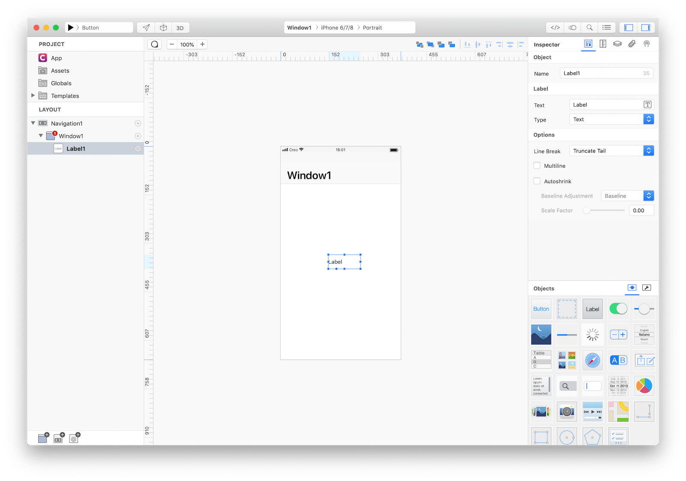

A label describes an onscreen interface element or provides a short message. Although people can’t edit labels, they can sometimes copy the content of labels. Labels can display any amount of static text but are best kept short.



### Best practices
* **Keep labels legible.** Labels can include plain or styled text. If you adjust the style of a label or use custom fonts, be sure to not sacrifice legibility. It’s best to adopt Dynamic Type so your labels still look good when a user changes text size on their device.

### How to use
1. Drop a `Label` control from the object panel to a `Window`
2. Use the `Label Inspector` to customize its properties like `Text` and `Multiline`


The inspector where the `Label` class can be configured.

### Example
1. Drop a `Button` control from the object panel to a `Window`
2. Open the `Code Editor` (cmd + 6)
3. Select the `Action` item inside the `Events` area and write your custom code in the `Code Editor`
```
Label1.text = "Label Text"
```

### Most important properties
Several UI aspects can be configured in the `Label` class but the `text`, `font`, and `textColor` are the most commons to be configured.
- `text`: The text displayed by the label.
- `font`: The font of the text.
- `textColor`: The color of the text.

### References
[Label class reference](../classes/Label.html) contains a complete list of properties and methods that can be used to customize a `Label` object.
