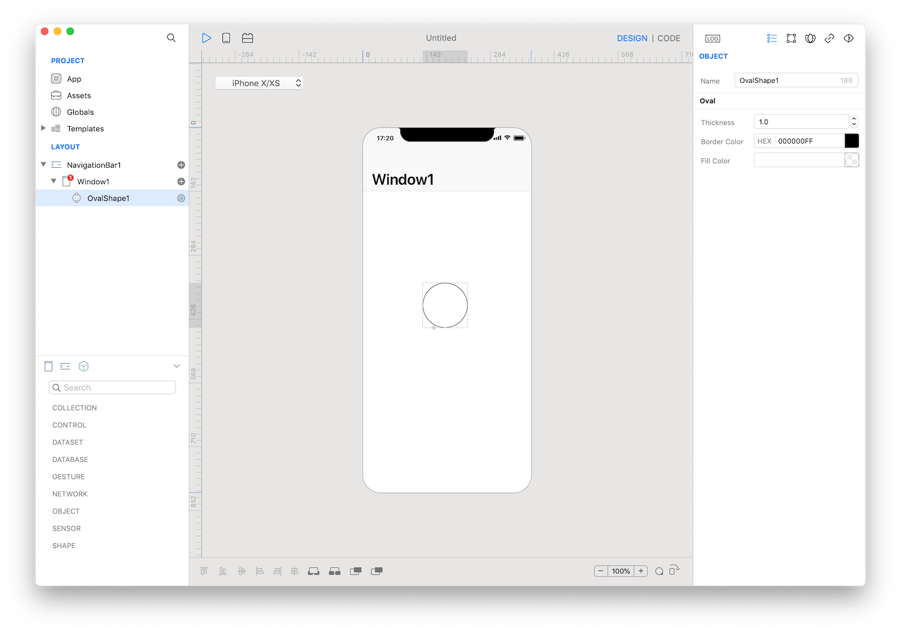

Represents an oval shape.



### How to use
1. Drop a `OvalShape` control from the object panel to a `Window`
2. Use the `OvalShape Inspector` to customize its properties like `Thickness`, `Border Color`, and `Fill Color`


The inspector where the `OvalShape` class can be configured.

### Example
1. Drop a `Button` control from the object panel to a `Window`
2. Open the `Code Editor`
3. Select the `Action` item inside the `Events` area and write your custom code in the `Code Editor`
```
OvalShape1.fillColor = Color.red
OvalShape1.strokeColor = Color.black
OvalShape1.strokeThickness = 4
```

### Most important properties
Several UI aspects can be configured in the `OvalShape` class but the `fillColor`, `strokeColor`, and `strokeThickness` are the most commons to be configured.
- `fillColor`: Color used to fill the shape.
- `strokeColor`: Color used to stoke shape border.
- `strokeThickness`: Border thickness.

### References
[OvalShape class reference](../classes/OvalShape.html) contains a complete list of properties and methods that can be used to customize a `OvalShape` object.
