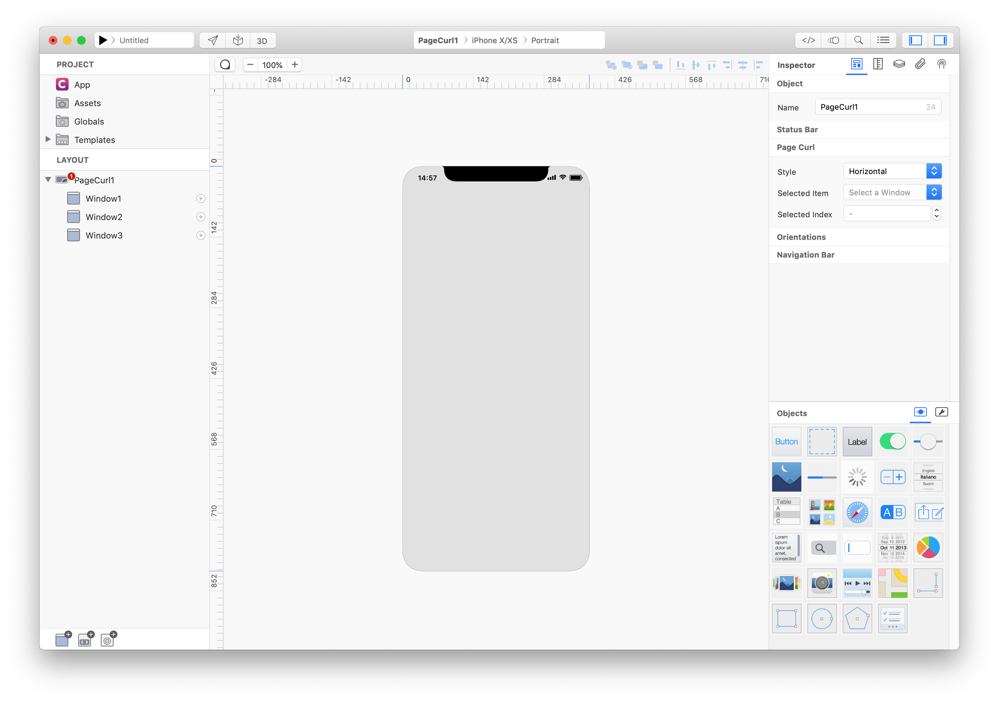
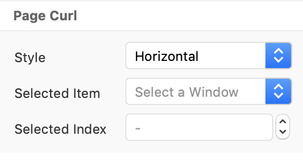
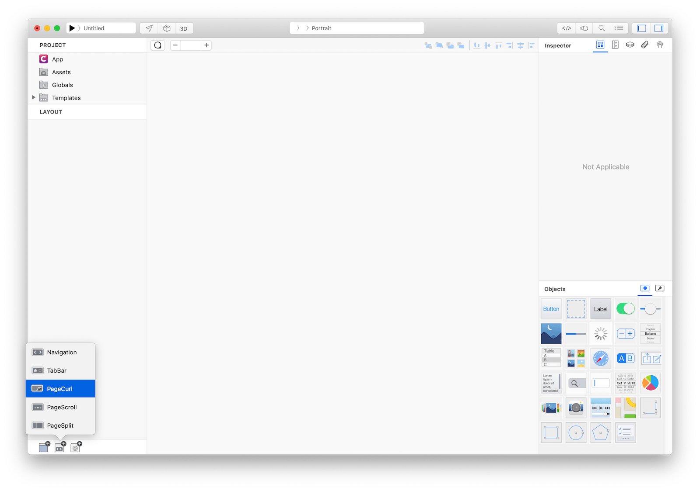

A `PageCurl` provides a way to implement linear navigation between pages of content, such as in a document, book, notepad, or calendar. The `PageCurl` transition causes pages to curl over as you swipe across the screen, turning like pages in a physical book.



### Best practices
When a `PageCurl` or `PageScroll` is used, pages flow sequentially and there’s no way to jump between nonadjacent pages. If people may need to access pages out of sequence in your app, implement a custom control that provides this functionality.

### How to use
1. Drop a `PageCurl`
2. Use the `PageCurl Inspector` to customize its curling direction  (`Style`)
3. Drop 1 or more child `Window`


The inspector where the `PageCurl` class can be configured.

### Example
- Start adding a `PageCurl` by tapping the _New Navigation_ button on the _Objects Bar_



- Configure the `Style` property from the inspector
- Create the `PageCurl` hierarchy by adding `Window` child screens
- For each `Window` set a different background color
- Repeat until you have a hierarchy like this

```
- PageCurl (startup window)
 - Window1
 - Window2
 - Window3
```

- Tap _Play_ and swipe to test the pages transition.

### Most important properties
Few UI aspects can be configured in the `PageCurl` class and `Style` is the most important
- `Style`: is the curling direction, horizontal or vertical

### References
[PageCurl class reference](../classes/PageCurl.html) contains a complete list of properties and methods that can be used to customize a `PageCurl` object.
