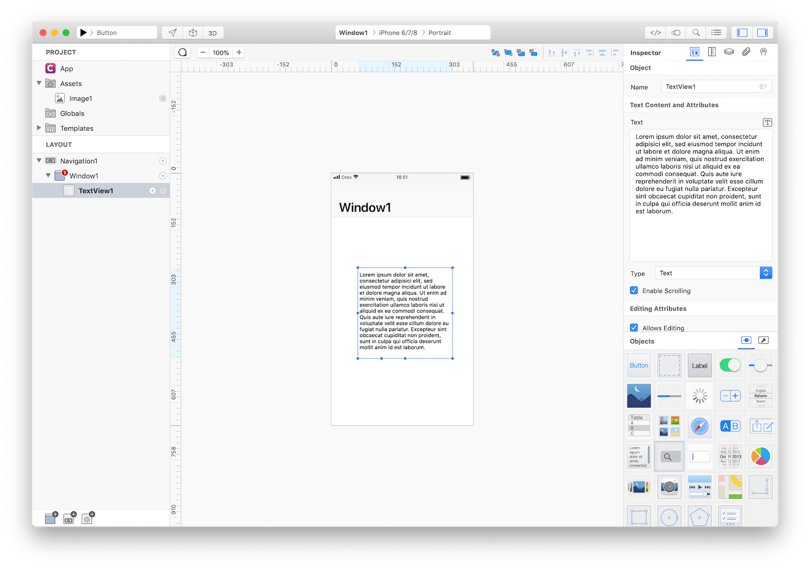

A text view displays multiline, styled text content. Text views can be any height and enable scrolling when the content extends outside of the view. By default, content within a text view is left-aligned and uses the system font in black. If a text view is editable, a keyboard appears when you tap inside the view.



### Best practices
* **Keep text legible.** Although you can use multiple fonts, colors, and alignments in creative ways, it’s essential to maintain the readability of your content. It’s a good idea to adopt Dynamic Type so your text still looks good if people change text size on their device. You should also test your content with accessibility options enabled, such as bold text.
* **Show the appropriate keyboard type.** iOS provides several different keyboard types, each designed to facilitate a different type of input. To streamline data entry, the keyboard displayed during the editing of a text view should be appropriate for the type of content in the field.

### How to use
1. Drop a `TextView` control from the object panel to a `Window`
2. Use the `TextView Inspector` to customize its properties like `Text`, `Enable Scrolling`, and `Allows Editing`

If you need to write code for TextView:

3. Open the `Code Editor` (cmd + 6)
4. Select the `Changed` item inside the `Events` area and write your custom code in the `Code Editor`


The inspector where the `TextView` class can be configured.

### How to customize
The `TextView` can be customized by tapping the subnode icons (+).


The `TextView` customizations.

### Input View
The custom input view to display when the text view becomes active. The user can drop one or more controls in order to create the custom input view.


The `TextView` input view customization.

### Keyboard Accessory View
The custom accessory view to display when the text view becomes active. The user can drop one or more controls in order to extend the default keyboard.


The `TextView` keyboard accessory view customization.

### Example
1. Drop a `Button` control from the object panel to a `Window`
3. Open the `Code Editor` (cmd + 6)
4. Select the `Action` item inside the `Events` area and write your custom code in the `Code Editor`
```
TextView1.text = "Text"
```

### Most important properties
Several UI aspects can be configured in the `TextView` class but the `text`, `textColor`, and `editable` are the most commons to be configured.
- `text`: The text displayed by the text view.
- `textColor`: The color of the text.
- `editable`: A Boolean value indicating whether the receiver is editable.

### References
[TextView class reference](../classes/TextView.html) contains a complete list of properties and methods that can be used to customize a `TextView` object.
