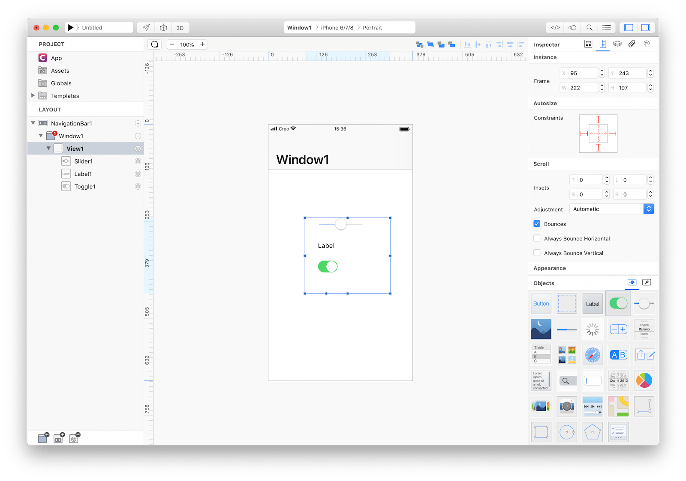
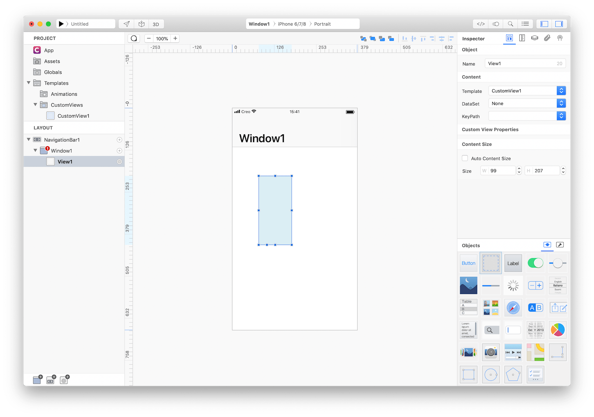
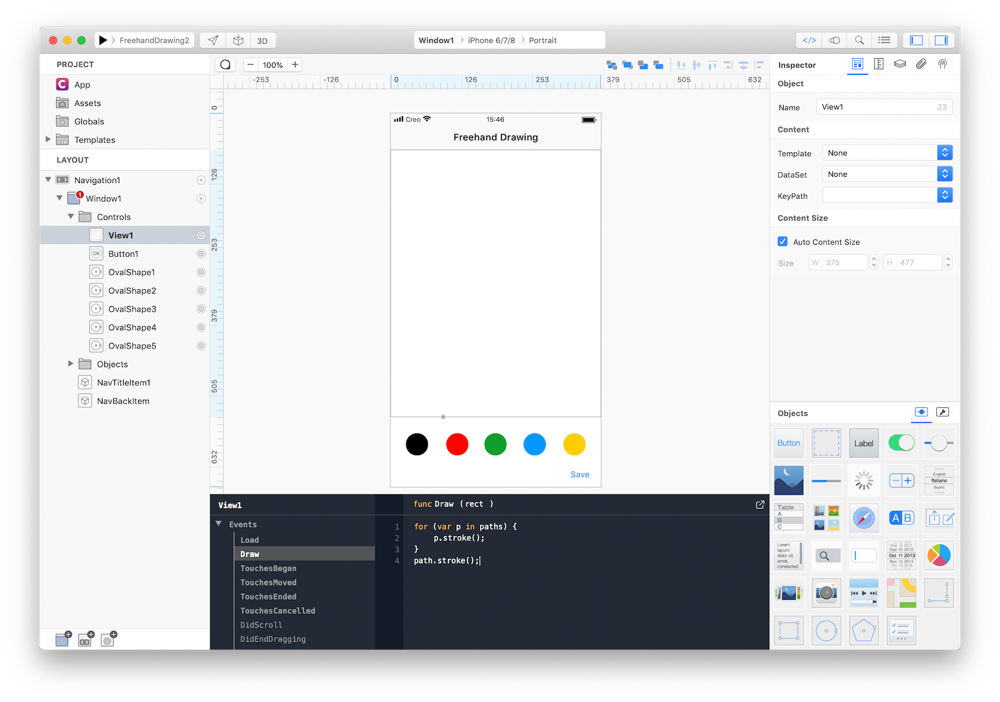
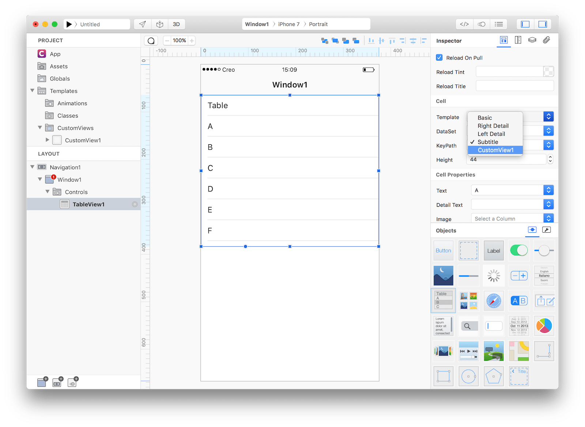
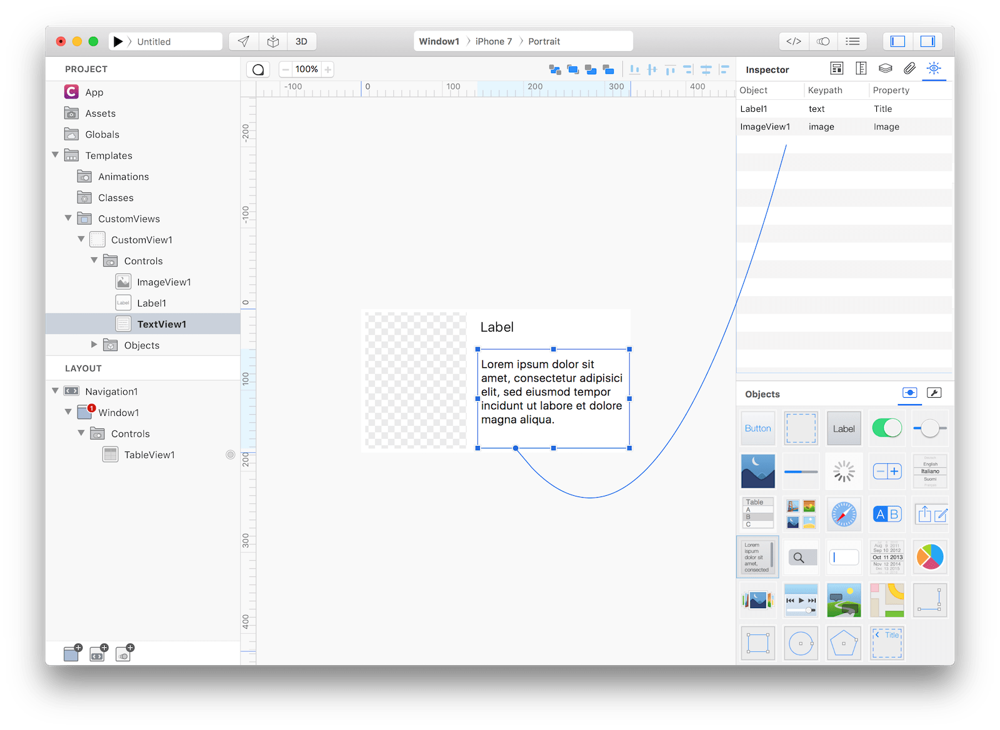
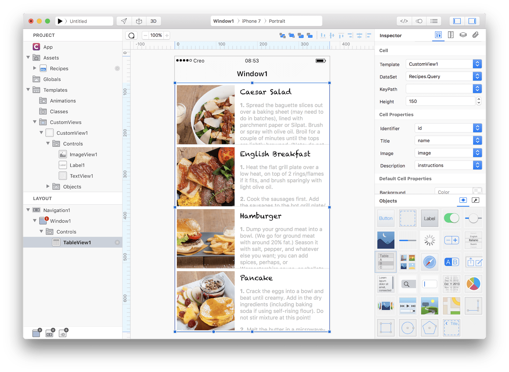

The View is probably one of the most powerful controls. Views are the fundamental building blocks of your app's user interface, and the View class defines the behaviors that are common to all views. A view object renders content within its bounds rectangle and handles any interactions with that content. A View in Creo can be used in many different ways:

### Containers for other controls
A View is the only control that can include others controls. Just drop a control over its icon and it will automatically be included inside its hierarchy. This represents a very powerful way to centralize the logic (and the code) for more complex controls.



Using dot notation you have full access to sub-controls, for example
```
View1.Label1.text = "Hello World"
```

### Scroll content
A scroll view allows users to browse content that’s larger than the visible area. As people swipe, flick, drag, tap, and pinch, a scroll view follows the gesture, revealing or zooming content in a way that feels natural. A scroll view itself has no appearance but does display transient scrolling indicators as people interact with it.



In order to configure ScrollView, you need to set a template for a View (see CustomView below) and then uncheck the **Auto Content Size** setting. By using the Size and Scroll setting (in the Geometry panel) you'll be able to configure ScrollView behavior.

### Draw Programmatically
There are times when you really need to use Gravity code in order to draw inside a View. In this case, you can use the Draw event. We use that event to implement the [Freehand Drawing](https://docs.creolabs.com/tutorials/freehand-drawing.html) tutorial.



### CustomView
If you double click a View or if you drop a View in the Templates folder then your View became a CustomView (it is like a template that can be used in many different places). A CustomView is like a new UI based control that can be used to customize the appearance for all the controls that can accept a CustomView. In this version there are several controls that can be customized using a CustomView:
* [View](../classes/View.html)
* [TableView](../classes/TableView.html)
* [CollectionView](../classes/CollectionView.html)
* [PageContainer](../classes/PageContainer.html)
* [Carousel](../classes/Carousel.html)


Once a CustomView has been created it will be globally visible from the Inspector for all the controls that can accept it.


### Configuring a CustomView
A CustomView is like a new control that can contain others controls and that can be fully customized to better fit your needs. Suppose for example that you need to display an image, a title and a long text description into your new TableView.


The right way to proceed is to first design your CustomView with the controls you need to use, in this case an ImageView, a Label and a TextView.
Then you need to expose your CustomView properties and bound them to the internal control's properties.

In this case what you want is a CustomView with three properties:
* Description bound to **TextView1.text**
* Image bound to **ImageView1.image**
* Title bound to **Label1.text**
These configurations can be easily created using drag and drop from the control **[binding anchor point](bindings.html)** to the Exposed Properties inspector panel.
Once a property has been exposed you can access it from the containers inspector or from the code editor using the dot notation.





### Connecting a CustomView
In order to connect a CustomView to a container control just select the container control from the Layout pane (a TableView in this example) and choose the CustomView from the Templates properties inspector. Selected control immediately reflects the user interface change and the inspector will list the CustomView exposed properties under the Cell Properties section.


To display real data you need to connect the container control with a **[DataSet](dataset.html)** and then bound DataSet properties to cell properties directly from the Inspector.
