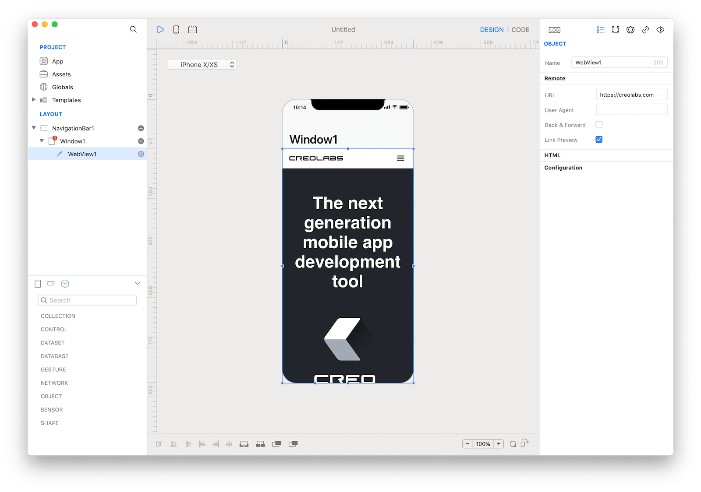

A web view loads and displays rich web content, such as embedded HTML and websites, directly within your app. Mail uses a web view, for example, to show HTML content in messages.



### Best practices
* **Enable forward and back navigation when appropriate.** Web views support forward and back navigation, but this behavior is disabled by default. If people will use your web view to visit multiple pages, enable forward and back navigation, and provide corresponding controls to initiate these features.
* **Avoid using a web view to build a web browser.** Using a web view to let people briefly access a website without leaving the context of your app is fine, but Safari is the primary way people browse the web on iOS. Attempting to replicate the functionality of Safari in your app is unnecessary and discouraged.

### How to use
1. Drop a `WebView` control from the object panel to a `Window`
2. Use the `WebView Inspector` to customize its properties like `URL`, and `Allows Link Preview`

If you need to write code for WebView:

3. Open the `Code Editor`
4. Select the `DidFinish` item inside the `Events` area and write your custom code in the `Code Editor`


The inspector where the `WebView` class can be configured.

### Example
1. Drop a `Button` control from the object panel to a `Window`
2. Open the `Code Editor`
3. Select the `Action` item inside the `Events` area and write your custom code in the `Code Editor`
```
WebView1.url = "https://www.creolabs.com"
```

### Most important properties
Several UI aspects can be configured in the `WebView` class but the `url`, `allowsBackForwardNavigationGestures`, and `allowsLinkPreview` are the most commons to be configured.
- `url`: Navigates to a requested URL.
- `allowsBackForwardNavigationGestures`: A Boolean value indicating whether horizontal swipe gestures will trigger back-forward list navigations.
- `allowsLinkPreview`: A Boolean value that determines whether pressing on a link displays a preview of the destination for the link. In iOS this property is available on devices that support 3D Touch. Default value is false in iOS.

### References
[WebView class reference](../classes/WebView.html) contains a complete list of properties and methods that can be used to customize a `WebView` object.
