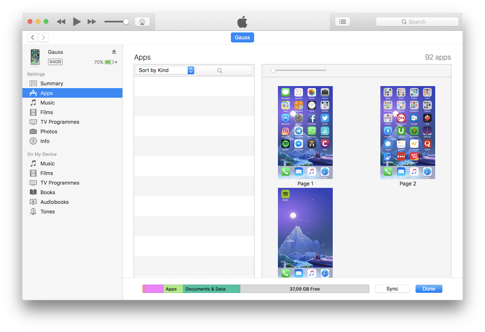
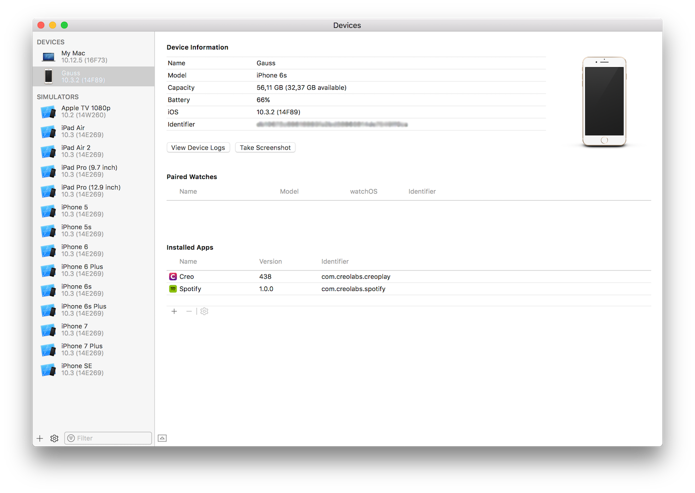

Once you are ready to test your application to a real device or once you are ready to submit it to the App Store you can compile your project directly within **Creo**. Just select Build Application from Creo's toolbar and a new dialog will appear.

The build application process will end up with an IPA file ready to be submitted to the iOS App Store or ready to be transferred to your device. An IPA is a special file that contains iOS executables, resources and certificates needed to run your app on a real device.

* ***Bundle ID** lets iOS recognize any updates to your app. Your Bundle ID must be registered with Apple and be unique to your app.
* In **Package Distribution** choose **iOS App Store Distribution** if you want to create an IPA ready to be submitted to the App Store. Choose **Development Distribution** if you want to create an IPA to install on your development devices (in this case a correct Provisioning Profile is required). Choose **AdHoc Distribution** if you need to build an IPA with your Enterprise certificate (in this case a correct Provisioning Profile is required).
* A **Signing Identity** is Apple's security mechanism to authenticate your identity. It allows users to trust that the application has been created by an authorized source known to Apple and has not been tampered with. All code must be code signed in order to run on any device or distributed on the app store.
* A **Provisioning Profile** is a special file that contains a collection of digital entities that uniquely ties developers and devices to an authorized iPhone Development Team and enables a device to be used for testing. A Development Provisioning Profile must be installed on each device on which you wish to run your application code. Each Development Provisioning Profile will contain a set of iPhone Development Certificates, Unique Device Identifiers and an App ID. Devices specified within the provisioning profile can be used for testing only by those individuals whose iPhone Development Certificates are included in the profile. A single device can contain multiple provisioning profiles.

#### Submit your app to the App Store
If you don't have an Apple developer account or if you don't have any certificate, then you should first follow the tutorials from the excellent **[raywenderlich.com](https://raywenderlich.com)** website. Everything in part 1 and part 2 (except the Submit An App With Xcode paragraph) is valid and must be followed:
* **[How to Submit An App to Apple - Part 1](https://www.raywenderlich.com/184709/submit-app-apple-no-account-app-store-part-1)**
* **[How to Submit An App to Apple - Part 2](https://www.raywenderlich.com/184825/submit-app-apple-no-account-app-store-part-2)**
Once everything has been setup with Apple, you can press the Build Package button and start creating your app:

Please note that you should provide your Signing Identity and Provisioning Profile.

The result of this build is an ipa archive that you can submit to App Store using:
* **[Application Loader](https://help.apple.com/itc/apploader/)** from Apple (distributed within the **[Xcode](https://developer.apple.com/xcode/) package**)
* **[Fastlane](https://docs.fastlane.tools/getting-started/ios/appstore-deployment/)** from Google

#### Transfer your app to a device
Once you created an IPA executable using **Development Distribution** as Package Distribution option you can transfer it to your USB connected device using one of the following methods:
* **iTunes: ** Just follow these **[instructions in you have iTunes 12.6 or older](http://stackoverflow.com/questions/26720764/install-ipa-with-itunes-12)**. Apple removes Apps section from iTunes starting from version **[12.7](https://codeburst.io/latest-itunes-12-7-removed-the-apps-option-how-to-install-ipa-on-the-device-3c7d4a2bc788)**.

* **Xcode:** From the Window menu select "Devices and Simulators" then just drop your IPA file to the **Installed Apps** section.

* **Apple Configurator 2: ** Download **[Apple Configurator 2](https://itunes.apple.com/us/app/apple-configurator-2/id1037126344?mt=12)** from MacOS App Store. Connect your iOS device to your Mac and then double click on the device icon. Select the Apps section and then drop your IPA file.

* **ios-deploy:** It is an open source command line tool that can be installed from **[https://github.com/phonegap/ios-deploy](https://github.com/phonegap/ios-deploy)**. 
Once installed execute **ios-deploy -d -b myapp.ipa**