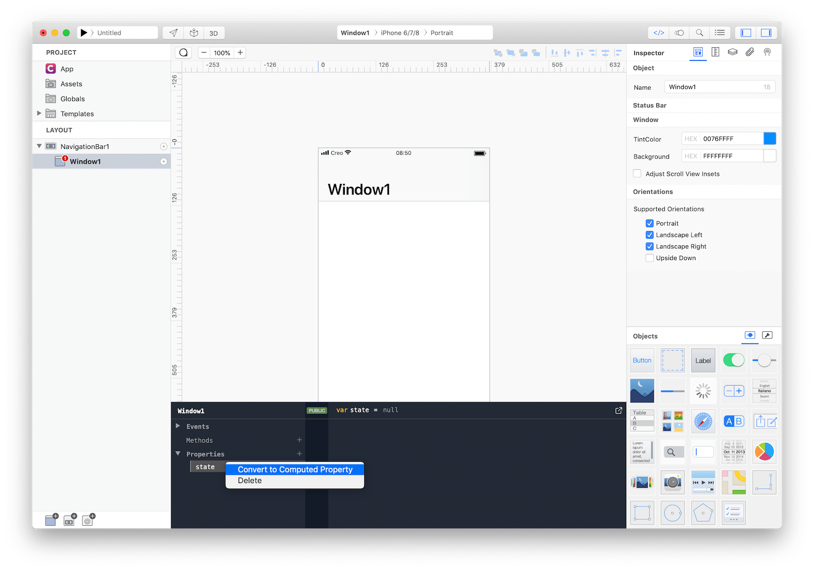

Creo greatly reduces app development time by automating the most common tasks with a simple drag'n drop interface but there are times where you need to write Gravity code in order to customize behaviors or to enhance default cases.


Gravity is a programming language developed from scratch for Creo. It is dynamically typed, as such, its main advantages are that:
* The language is simple and easy to learn.
* Most code can be written and changed quickly and without hassle.
* Less code written means less errors & mistakes to fix.
* Easier to read the code (less clutter).
* No compilation is required to test.
* Runtime is tiny.
* Duck-typing and polymorphism by nature. 


You can get more information about Gravity in its dedicated documentation [section](https://docs.creolabs.com/gravity/).
Gravity is an open source project and you can find its complete source code on [GitHub](https://github.com/marcobambini/gravity).


In Creo **everything is an object**. That means that every object can be selected and modified using both the Inspector or the Code Editor on the bottom. You usually use the Code Editor to modify values that can change at runtime while the Inspector is usually used to modify values that change at design time.


Each object comes with a predefined set of events and an empty set of methods and properties that you can customize. Events notify you about important changes that could require your interactions. For example, a Slider notifies that its value has changed using the Changed event, while a Button notifies that it has been touched using the Action event. By filling the appropriate events you can customize an object’s behaviors to better fit your needs. Every object can be further customized by adding functionalities (methods) and properties.

In order to know which methods and properties an object can respond to you can consult the [Classes](https://docs.creolabs.com/classes/) section of the documentation. An object responds to its own methods and properties and to all the methods and properties of its superclasses.

### Computed Properties

When a property is transformed into a computed property, it can be much more than a simple static value. It can hide a lot of implementation details and it can be used as a way to add a lot of power to your custom classes.

For example, if you add a ```state``` property to a Slider1 object then it will represent a static information that you can use later in your programming logic but if you transform that variable to a computed property (right-click on its name) then you can add a lot of logic when it is set (written) or get (read).



The ```get``` section represents the code that needs to be executed when your property is read or accessed in your code (for example in ```var myState = Slider1.state```). The _set_ section represents the code that needs to be executed when your property is written (for example in ```Slider1.state = myState```).

