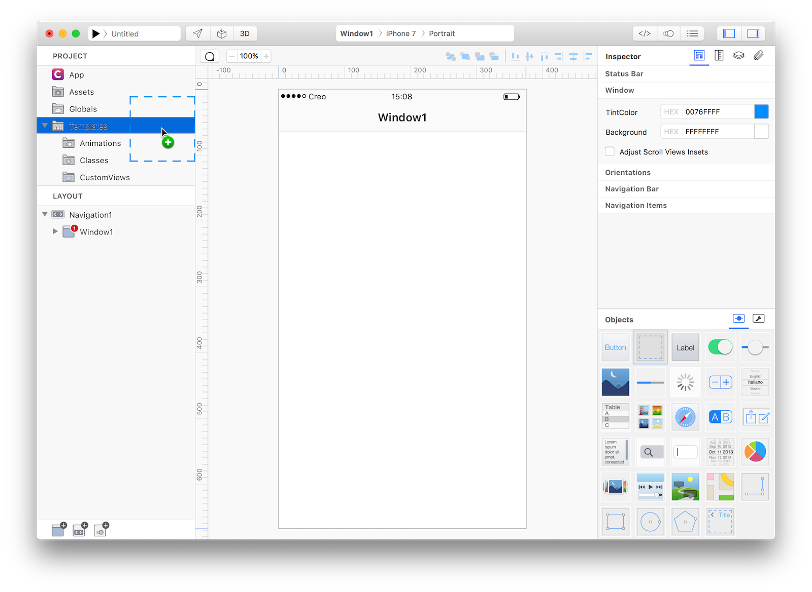

Controls can usually be customized using the Inspector pane. In that pane you can customize properties like the text to be displayed, the image to show, or the background color to use. The Inspector offers a lot of customization options. Several controls have been designed to be containers for other controls. For example, a default TableView is not very attractive since it can accept only text, for this reason **Creo** offers a very powerful way to completely customize these controls.

Start by dragging a View from the Objects pane into the Templates folder.

Once dropped a new CustomView will be created into the CustomViews folder.

A CustomView is like a new UI based control that can be used to customize the appearance for all the controls that can accept a CustomView. In this version there are several controls that can be customized using a CustomView:
* [View](../classes/View.html)
* [TableView](../classes/TableView.html)
* [CollectionView](../classes/CollectionView.html)
* [PageContainer](../classes/PageContainer.html)
* [Carousel](../classes/Carousel.html)

Once a CustomView has been created it will be globally visible from the Inspector for all the controls that can accept it.

#### Configuring a CustomView
A CustomView is like a new control that can contain others controls and that can be fully customized to better fit your needs. Suppose for example that you need to display an image, a title and a long text description into your new TableView.

The right way to proceed is to first design your CustomView with the controls you need to use, in this case an ImageView, a Label and a TextView.
Then you need to expose your CustomView properties and bound them to the internal control's properties.

In this case what you want is a CustomView with three properties:
* Description bound to **TextView1.text**
* Image bound to **ImageView1.image**
* Title bound to **Label1.text**
These configurations can be easily created using drag and drop from the control **[binding anchor point](bindings.html)** to the Exposed Properties inspector panel.
Once a property has been exposed you can access it from the containers inspector or from the code editor using the dot notation.

#### Connecting a CustomView
In order to connect a CustomView to a container control just select the container control from the Layout pane (a TableView in this example) and choose the CustomView from the Templates properties inspector. Selected control immediately reflects the user interface change and the inspector will list the CustomView exposed properties under the Cell Properties section.

To display real data you need to connect the container control with a **[DataSet](dataset.html)** and then bound DataSet properties to cell properties directly from the Inspector.