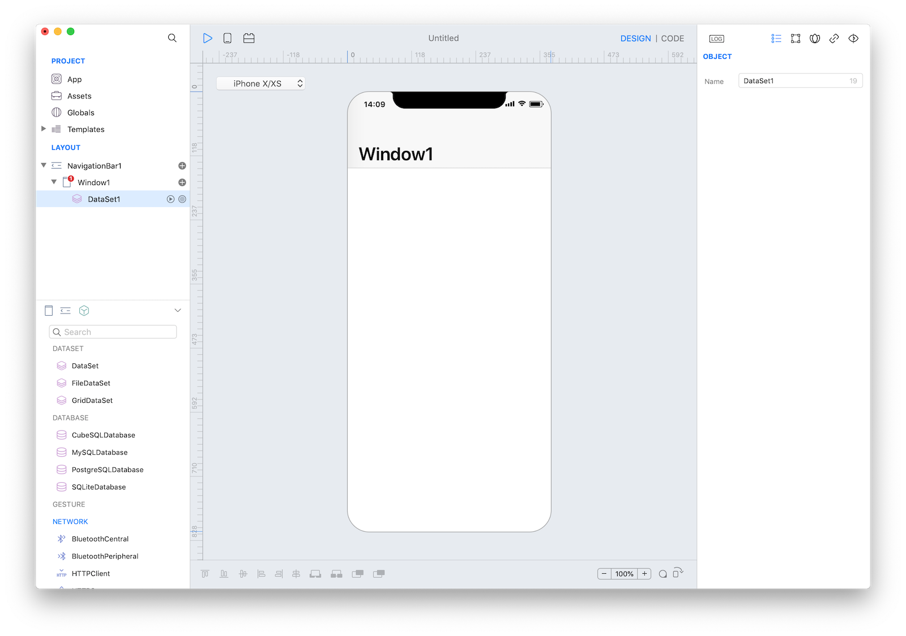
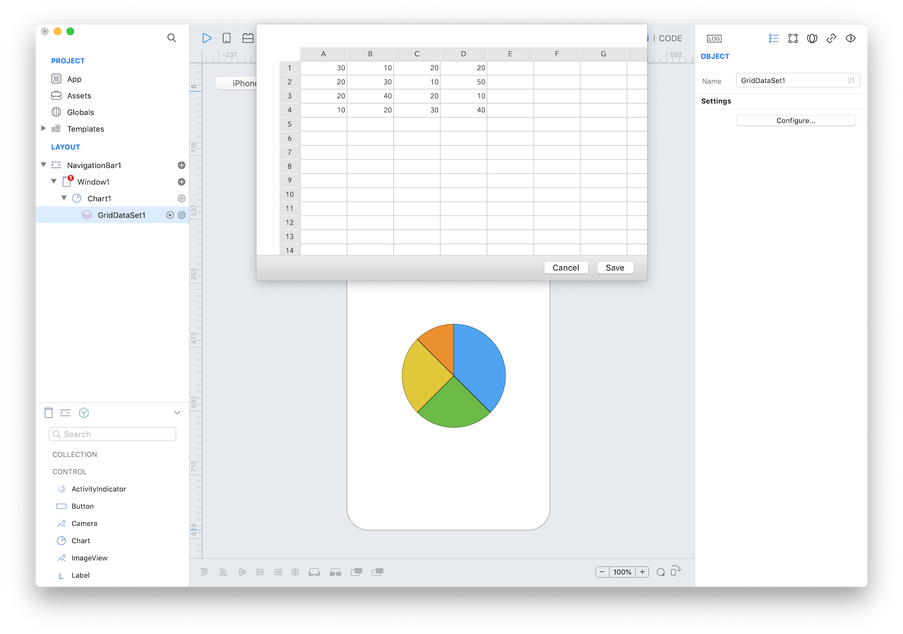

Every object that can read and/or write data is a subclass of the BaseDataSet class, more generally a DataSet is an object that can request dynamic data at runtime. Thanks to its underlying technology **Creo** is able to show dynamic data directly at design time without running your app.

A DataSet object can be created just dragging one of the available BaseDataSet subclasses from the Objects pane:


### DataSet
A DataSet is a programmatically customizable BaseDataSet. The number of rows, number of columns and the value for a specific row/column pair is defined by the return value of the `Rows`, `Columns` and `Value` events.
Example of a DataSet from a List of values:
1. Drop a `DataSet` object from the DATASET group of the objects panel to a `Window` and call it "DataSet1"
2. Open the `Code Editor` (cmd + 4)
3. Add a property named "content" to the "DataSet1"
4. Select the `Rows` item inside the `Events` area and write your custom code in the `Code Editor`
```
if (!(content is List)) return 0;
return content.count
```
5. Select the `Columns` item inside the `Events` area and write your custom code in the `Code Editor`
```
return 1
```
6. Select the `NameForColumn` item inside the `Events` area and write your custom code in the `Code Editor`
```
return "A"
```
7. Select the `Value` item inside the `Events` area and write your custom code in the `Code Editor`
```
if (!(content is List)) return null
return content[row]
```
8. Drop a `TableView` object from the COLLECTION group of the objects panel to your `Window` and call it "TableView1"
9. Configure the "TableView1" properties from the inspector with the following values: "DataSet1" in the `DataSet` field (Cell section), "A" (the name of the column) in the `Text` field (Cell Properties section).
10. Add a `Button` control from the CONTROL group of the objects panel to your `Window` and call it "Button1".
11. Select the `Action` item for the "Button1" control inside the `Events` area and write your custom code in the `Code Editor`:
```
DataSet1.content = ["Row 1","Row 2","Row 3"]
DataSet1.run()
```
12. Execute the project in the Simulator (cmd + R) and click on the "Button1" to set the "content" variable of the DataSet and to reload it, the TableView1 will show the specified content.


### GridDataSet
A GridDataSet is equivalent to an Excel/Numbers spreadsheet that you can fill with your data, to edit the data just select the GridDataSet object in the layout panel and press the "Configure..." button from the inspector. Controls that can accept data are bound to a Built-in GridDataSet added as a subnode of the control.


### Others
Several objects implement the BaseDataSet specs, for example Assets, RecordSet (queries) from Databases, HTTPRequest from HTTPClient (REST), BluetoothCentral, GPS, Gyro and others. We prepared detailed tutorials that show you how to create, configure and use each of them:
* For [SQLiteRecordSet](../classes/SQLiteRecordSet.html) and [SQLiteDatabase](../classes/SQLiteDatabase.html) classes read the **[LetsCook tutorial](../tutorials/lets-cook-nav.html)**.
* For more advanced SQLite Database usage read the **[ToDo tutorial](../tutorials/todo.html)**.
* For [HTTPRequest](../classes/HTTPRequest.html) and [HTTPClient](../classes/HTTPClient.html) classes read the **[Spotify tutorial](../tutorials/spotify.html)**.
* For [BluetoothCentral](../classes/BluetoothCentral.html) DataSet read the **[HeartRate tutorial](../tutorials/heart-rate.html)**.
* For Assets DataSet read the **[eBook tutorial](../tutorials/ebook.html)**.
Please note that the sqlite tutorials can be applied for others Databases subclasses like MySQL or PostgreSQL.
