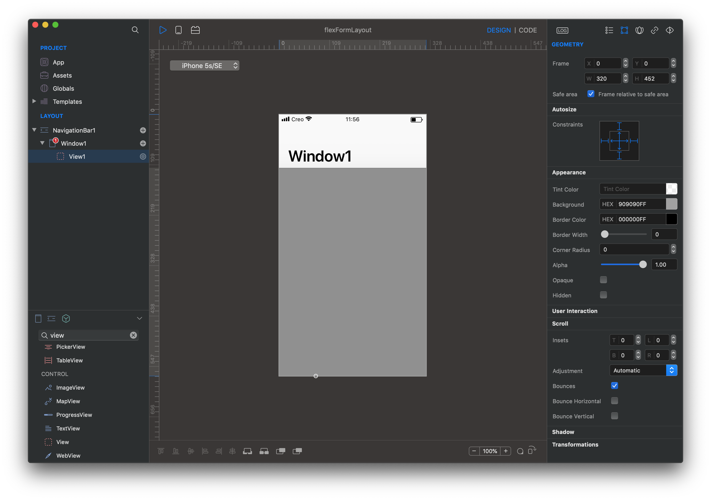
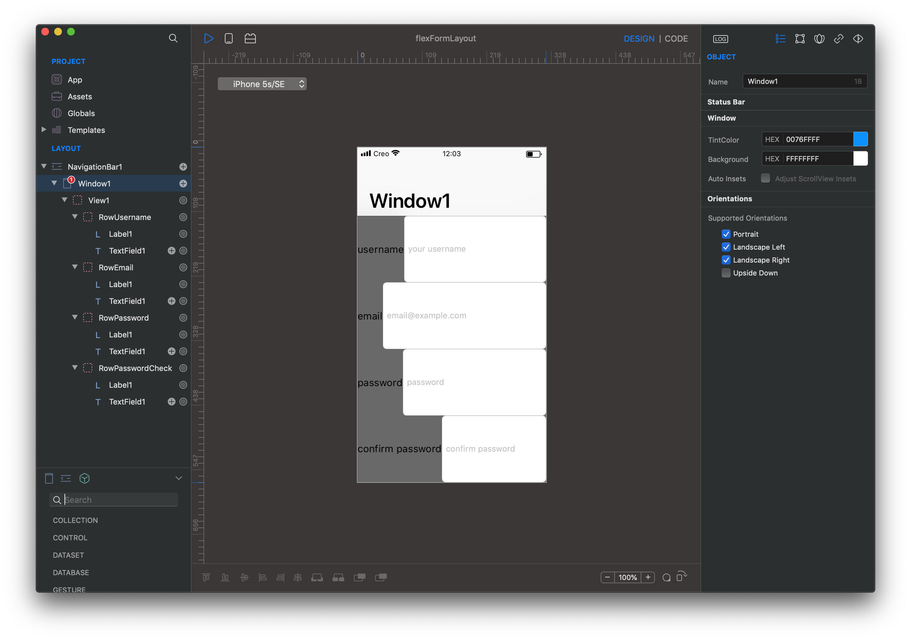
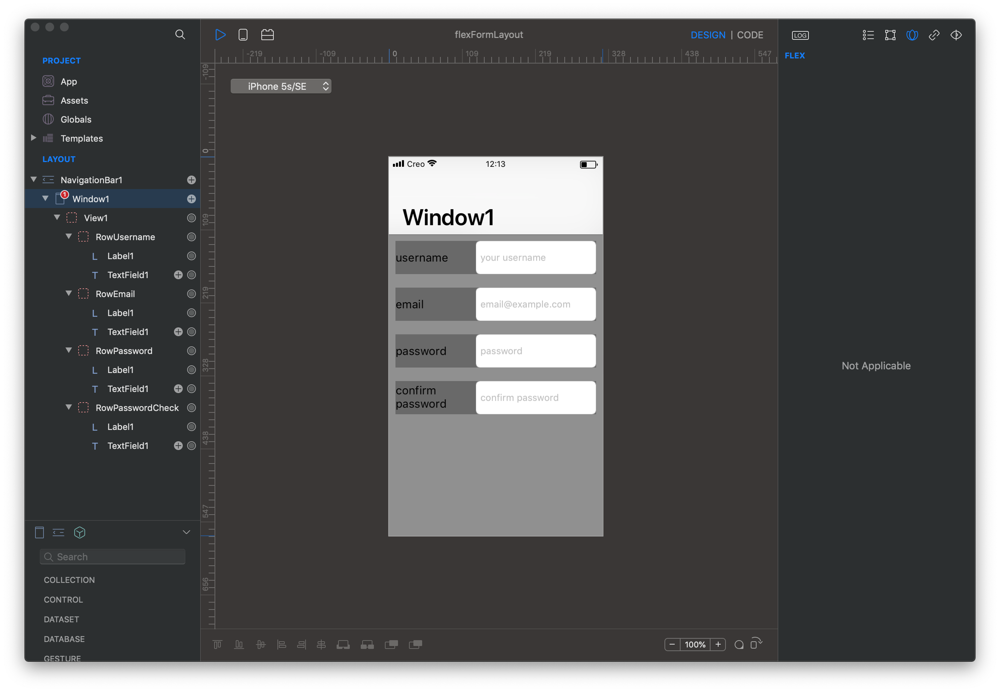

Creo adopts the widely used [Yoga](https://yogalayout.com/docs) library for advanced and dynamic layouts. This library implements **flex-box** a rinomated multi-platform layout engine adapted from the web world to help solving layout of complex interfaces across different screen size and idioms (ie. ios, ipad, landscape, portrait).

**Note:** in Creo the yoga engine coexistes with the iOS Autoresizing masks and nothing change for developers satisfied by the autosize layout engine. Even better, from Creo 2.x they also get **supports for the safe area** to properly support the new top-notch and rounded corners.

### Thinking Flex

The most important difference of **flex** (from now the abbreviation of flexbox) with the autosize mask is how you have to think about creating your interfaces.

#### 1. the `view` is a container for your UI controls or other containers

you are no longer required to think in terms of absolute dimensions and positioning, so you don't need to modify the frame of a view anymore, a flex enabled `view` automatically layout all its **flex enabled subviews** across the configured major axis (`column`, `row`, `column inverted`, `row inverted`).

To use `flex` start by adding a top view and enabling flex on it (tap the check box from the inspector panel) and then drop your UI controls on it. By default they will be positioned along the vertical direction (column).

**Note:** the children subviews have to be flex enabled too or by default they will keep using the autosizing mask.

For instance if you want a column of rows (ie. to create a login form) all you have to do is:

- add 1 top `view` and enable flex on it

- configure the `flex direction` to `column` (default)

- insert a `view` for each row:
  - enable flex on it
  - configure the `flex direction` to `row`
  - insert a `label` and a `text field` (don't forget to enable flex on them)

In general you can now have as many `view` you may need, they cost nothing and will help you creating outstanding layouts.

#### 2. the layout is dynamic, orientation is no longer a problem

a flex enabled `view` listen to its parent view size changes and to its own subviews hierarchy changes. When `flex` is in function you can re-order any view in the container and see **istantly** the new positioning.

You can also modify the dimensions of the parent view or the properties of any UI control and the layout automatically will re-calculate itself to satisfy new constraints. Of course this works with device rotation and safe-area too; supporting landscape and portrait can be solved by just using flex at the root view level.

#### 3. the content size may be flexible too

any flex enabled `view` can be set to automatically calculate its `content size` using flex to make the UI adapts to smaller screen by automatically allowing the content to scroll. This is one of the new 3 ways a content size can be configured:

- `fixed` (default) all subviews shrink or grow and eventually overflow to fit the view frame. There are no scrolling options in this case.

- `flex` the major direction becomes flexible and the subviews use as much space they are needed in that direction only. Therefore the view `content size` may become bigger than the frame and eventually allow the users to scroll the content.

- `manual` you enter your own values and the layout engine will use that as a reference size. In this case the content may scroll in all directions.

**Note:** try to mix them and have scrollabe subviews inside scrollabe containers all adapting to the device screen and without a single line of code.

#### 4. top containers view do not `shrink` or `grow`, childrens controls do

each flex enabled `view` defines a list of properties in the `flex` inspector to controll the alignment and the layout of its childrens. Some of these properties depend on the presence of a parent view container with flex enabled, therefore not all propertiers are always enabled.

When the parent view space is not big enough or is just to large to contain all its subviews the `shrink` and `grow` attributes kick-off and define how, and eventually, whats childrens get more or less spaces.

### Examples

#### Form layout

##### Step 1, create a root view container

1. start with a new project

1. add a `view` below `Window1` and resize its frame to fill all the available space starting from the bottom of the `Navigation Bar`

1. from the **GEOMETRY** inspector:

    1. enable `Frame relative to safe area` to let the view become responsive to the safe area changes

    1. click and turn on all `Constraints` to let the view follow the `Window1` screen space, this is required to properly support different devices and orientations

    1. apply a background color to easily identify the view

1. from the **FLEX** inspector:

    1. check `Enable` to let this view become a flex-box container for its childrens. From now on, all `flex` subviews with the flex checkbox enabled will automatically layout themself

    1. set `Flex Direction` to column (default value)

##### Step 2, add rows

Let's create 4 input fields with a describing label: username, email, password and confirm password

1. insert a new `view` into `View1` and rename it `RowUsername`, don't worry about the frame or the position

1. set a background color to easily identify the new view

1. enable flex from the **FLEX** inspector: note how the view reconfigure itself to fill `View1`. This is the default behavior controlled by the flex attribute `grow = 1.0`

1. insert a `Label` and a `TextField` into `RowUsername`, again don't worry about their position and size

1. select `RowUsername` **FLEX** inspector and configure `FlexDirection` to `row`

1. enable flex on both and note how they move to be positioned in `column` and fill all the space; don't worry to constraint their size for now, we work on it later

1. select `RowUsername` duplicate it (Cmd ^ D) to create the other fields, note how the layout starts to adapt the space to fill the new entries

Once here you can test different devices and orientations; they should just works.

##### Step 3, configure margins, width and heights

Let's put some margins around the fields

1. select all `Rows` views

1. from the **FLEX** inspector configure the `Margin` properties (left, right, bottom, top) with `10`

1. from the **FLEX** inspector configure `Max Height` to `50`

1. select all `Labels`

1. from the **FLEX** inspector configure `Width` to `40%`, note the `%` symbol can be used to specify a fraction of the total width

That's it! you have the base of form layout. If you add other views between the rows (ie a label to describe a category of fields) you can see the layout adapting.

Next.. flexible content size (coming soon)