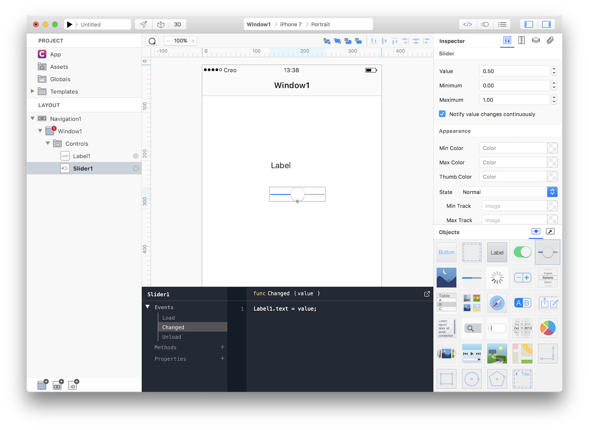

In Creo **everything is an object**. That means that every object can be selected and modified using both the Inspector or the Code Editor on the bottom. You usually use the Code Editor to modify values that can change at runtime while the Inspector is usually used to modify values that changes at design time.

Each object comes with a predefined set of events and an empty set of methods and properties that you can customize. Events notify you about important changes that could require your interactions. For example, a Slider notifies that its value has changed using the Changed event, while a Button notifies that it has been touched using the Action event. By filling the appropriate events you can customize object’s behaviors to better fit your needs.

Every object can be further customized by adding functionalities (methods) and properties. A property is usually a very good way to pass information between different windows.