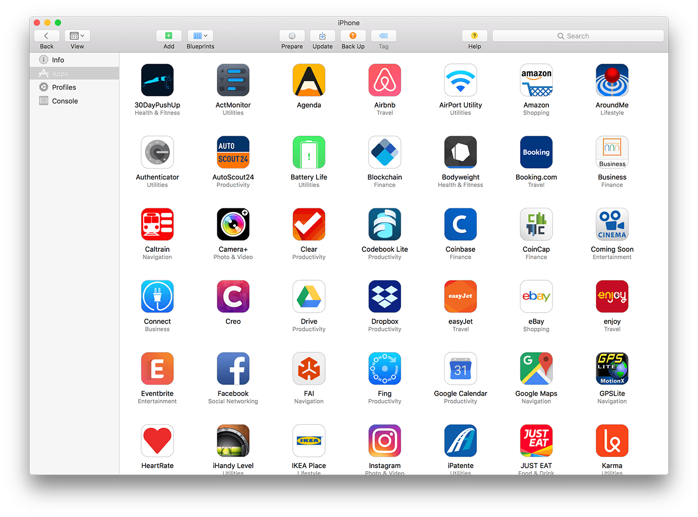

Once you created an IPA executable using **Development Distribution** as Package Distribution option you can transfer it to your USB connected device using one of the following methods:
* **iTunes: ** Just follow these **[instructions in you have iTunes 12.6 or older](http://stackoverflow.com/questions/26720764/install-ipa-with-itunes-12)**. Apple removes Apps section from iTunes starting from version **[12.7](https://codeburst.io/latest-itunes-12-7-removed-the-apps-option-how-to-install-ipa-on-the-device-3c7d4a2bc788)**.

* **Xcode:** From the Window menu select "Devices and Simulators" then just drop your IPA file to the **Installed Apps** section.

* **Apple Configurator 2: ** Download **[Apple Configurator 2](https://itunes.apple.com/us/app/apple-configurator-2/id1037126344?mt=12)** from MacOS App Store. Connect your iOS device to your Mac and then double click on the device icon. Select the Apps section and then drop your IPA file.

* **ios-deploy:** It is an open source command line tool that can be installed from **[https://github.com/phonegap/ios-deploy](https://github.com/phonegap/ios-deploy)**. 
Once installed execute **ios-deploy -d -b myapp.ipa**