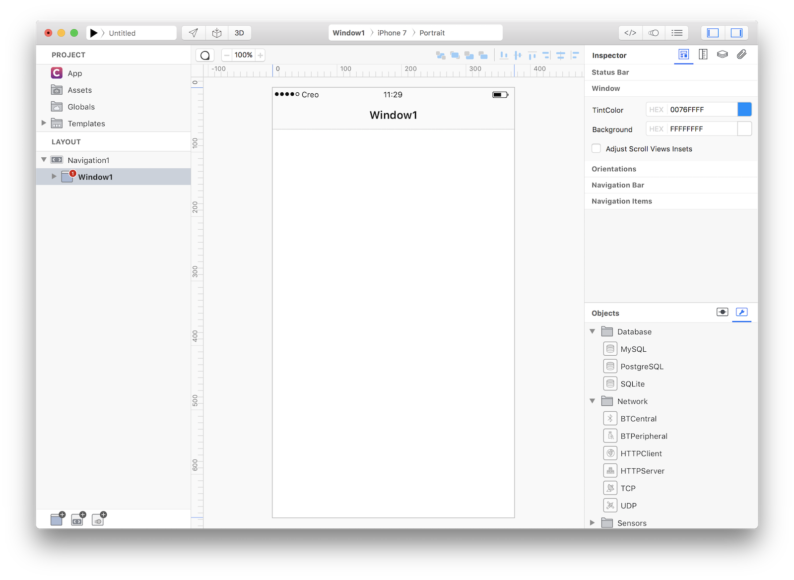
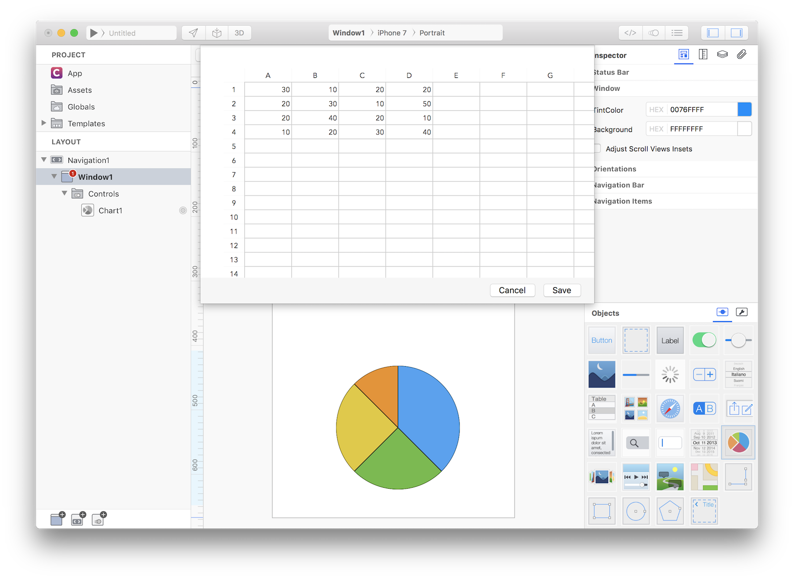

Every object that can read and/or write data is a subclass of the DataSet class, more generally a DataSet is an object that can request dynamic data at runtime. Thanks to its underlying technology **Creo** is able to show dynamic data directly at design time without running your app.

A DataSet object can be created just dragging a Class from the Objects pane:

Several objects implement the DataSet specs, for example Assets, Databases, HTTPClient (REST), BTCentral, Location, Motion and many others. We prepared detailed tutorials that show you how to create, configure and use each of them:
* For SQLite Database DataSet read the **[LetsCook tutorial](https://docs.creolabs.com/tutorials/lets-cook-nav.html)**.
* For more advanced SQLite Database DataSet usage read the **[ToDo tutorial](https://docs.creolabs.com/tutorials/todo.html)**.
* For HTTPClient DataSet read the **[Spotify tutorial](https://docs.creolabs.com/tutorials/spotify.html)**.
* For Bluetooth DataSet read the **[HeartRate tutorial](https://docs.creolabs.com/tutorials/heart-rate.html)**.
* For Assets DataSet read the **[eBook tutorial](https://docs.creolabs.com/tutorials/ebook.html)**.
Please note that the sqlite tutorials can be applied for others Databases subclasses like MySQL or PostgreSQL.

#### DataGrid
Controls that can accept data are bound to a Built-in DataSet which is a static representation of the data that can be displayed. A static built-in DataSet is represented by a DataGrid which is equivalent to an Excel/Numbers spreadsheet that you can fill with your data. That data can be edited just double clicking over the object.

