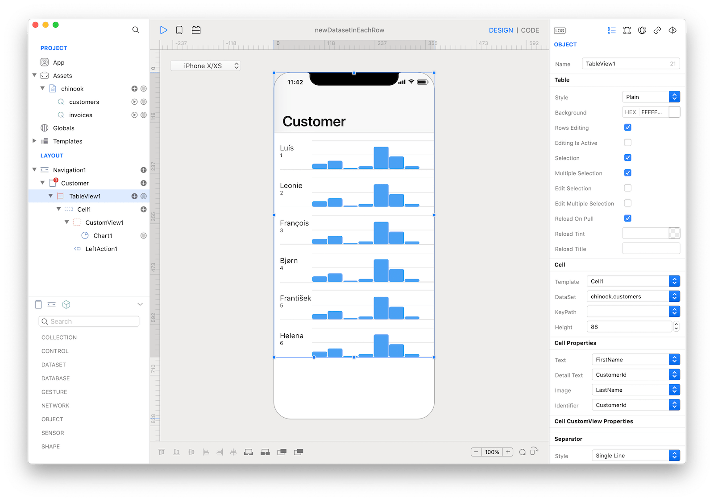
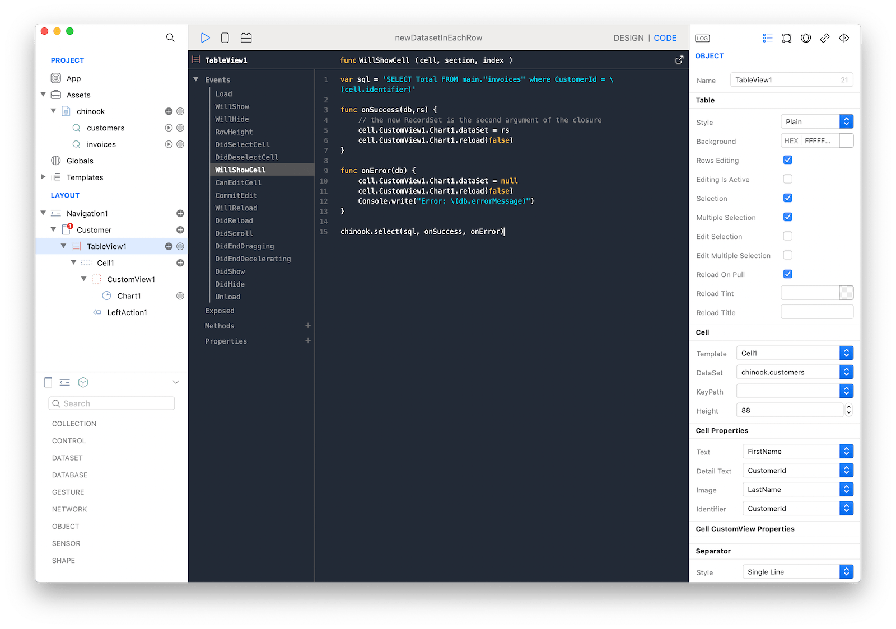
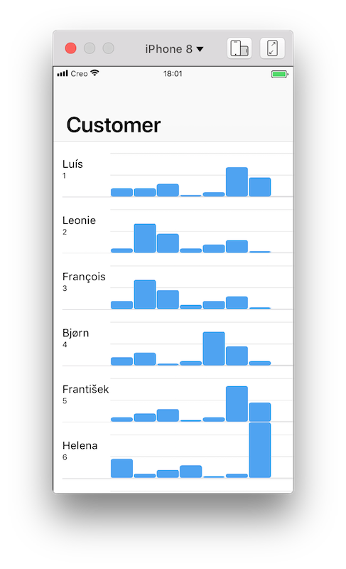

How to use a new Database query that depends on the cell identifier as the Dataset of a control inside each cell instance.

For this example we'll use a test SQLite DB file from [https://github.com/lerocha/chinook-database](https://github.com/lerocha/chinook-database)

The SQLiteRecordSet `chinook.customers` is used as the DataSet of the `TableView1` to show a row for each customer.



The SQLiteRecordSet `chinook.invoices`, with a statically configured filter for one customer, is used as the DataSet of the `Chart1` in the `CustomView1` inside the `Cell1` just to show real data in during the design time.


The `dataSet` property of the `Chart1` in each cell will be overridden at runtime to use a specific query depending on the custemerId of each row. The new SQLiteRecordSet for each row is done with the following code in the `WillShowCell` event of the `TableView1`:
```
var sql = 'SELECT "Total" FROM main."invoices" where CustomerId = \(cell.identifier)'

//Console.write("cell text \(cell.text)")

func onSuccess(db,rs) {
	//Console.write("onSuccess \(cell.identifier) \(rs)")

	if (rs) cell.CustomView1.Chart1.dataSet = rs
	else cell.CustomView1.Chart1.dataSet = null

	cell.CustomView1.Chart1.reload(false)
}

func onError() {
	Console.write("Error: \(sql)")
}

chinook.select(sql, onSuccess, onError)
```



This is what is shown when running the App in the Simulator:



**Project**
* [newDatasetInEachRow.creoproject]({{github_raw_link}}/assets/new_dataset_in_each_row.creoproject.zip) (389KB)
