#### Concepts
When you need to learn a new language and a new development environment the first app that you usually develop is a simple **[Hello World](https://en.wikipedia.org/wiki/%22Hello,_World!%22_program)** app.
With the same amount of time you usually spend to develop a Hello World app, with **Creo** you can build a fully featured and more complex application, in this case we'll show you how to create a web browser.

#### Classes
* [WebView](../classes/WebView.md)
* [TextField](../classes/TextField.md)
* [Keyboard](../classes/Keyboard.md)

#### Assets
* None

#### Steps
++1++ Start Creo and select "New Creo project" from the Wizard dialog.

You'll end up with a new empty project:
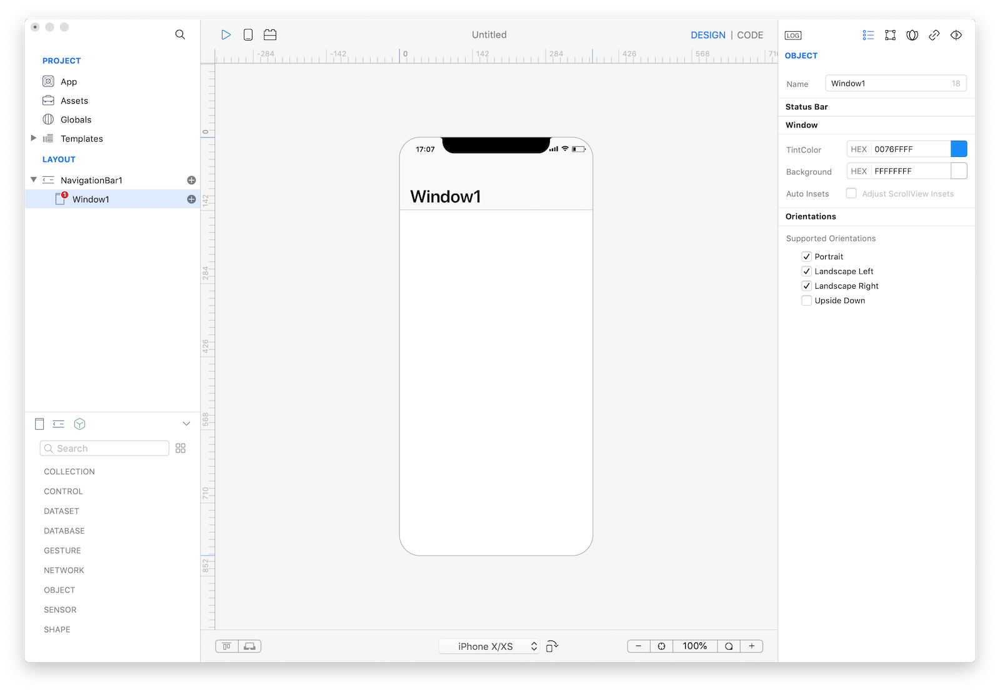

++2++ Drag Window1 (in the Layout section) above Navigation1 (we do not need a Navigation in this example):
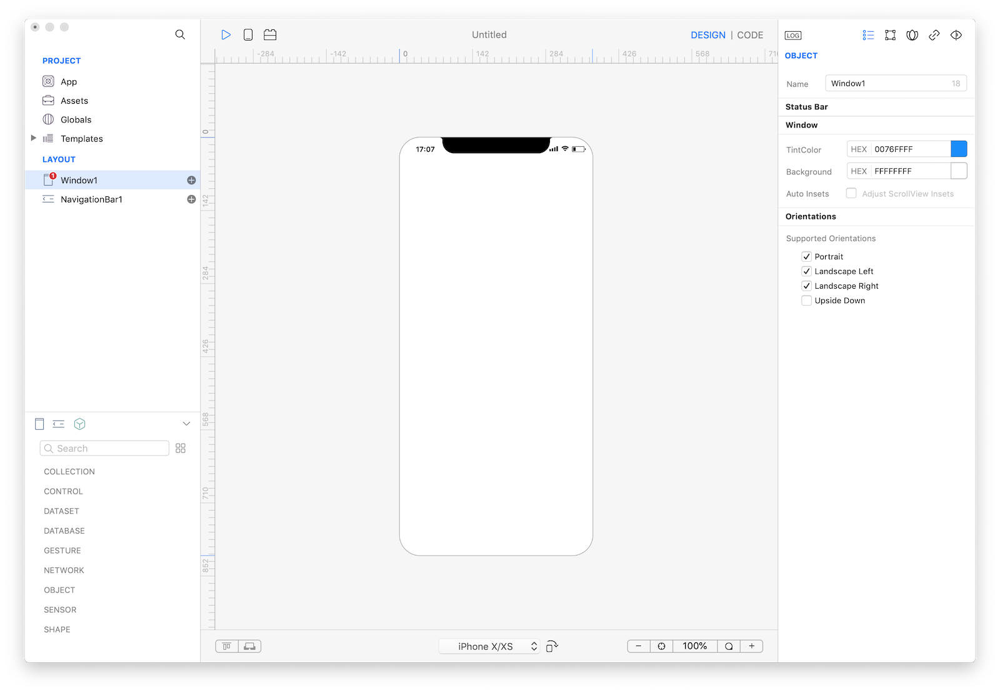

++3++ Delete the Navigation1 right-clicking on it and selecting "Delete..." from the contextual menu.

++4++ Drop a WebView from the Objects panel to the Design Board (and adjust its size according to the screenshot):
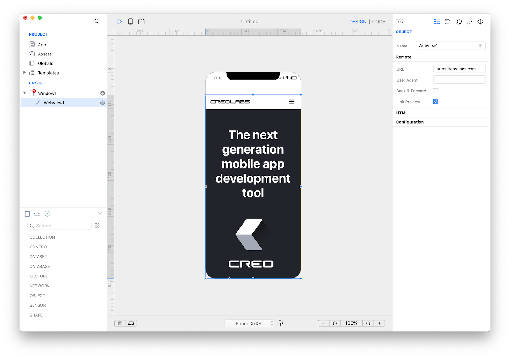

++5++ Drop a TextField from the Objects panel to the Design Board (and adjust its size according to the screenshot):
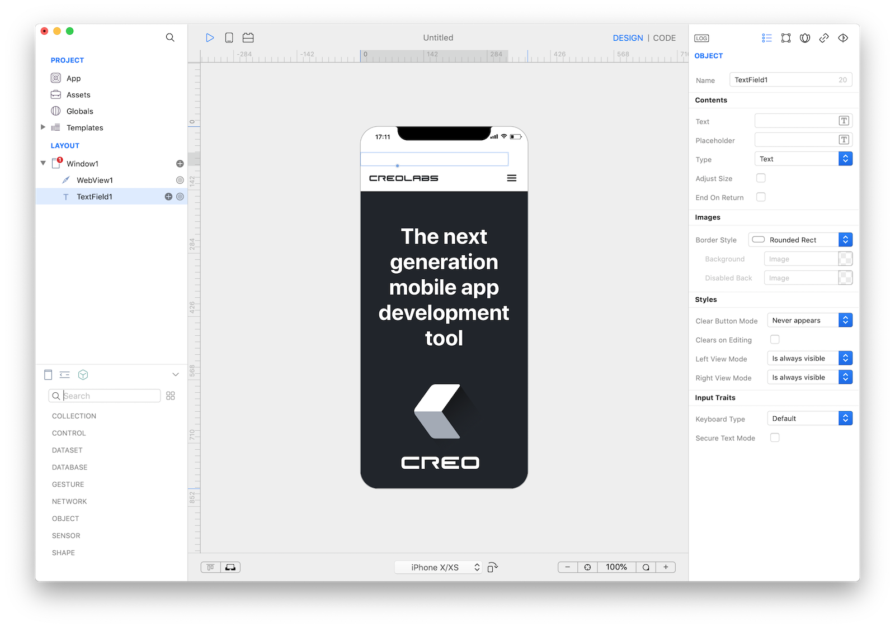

++6++ Drop a Button from the Objects panel to the Design Board (and adjust its size according to the screenshot). Change its Title property in the Inspector panel from Button to Go:
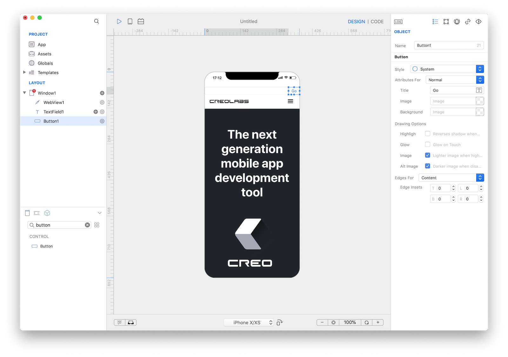
			
Application user interface is now completed and so far you have already learned how to setup a Navigation Hierarchy, how to instantiate Objects and how to modify their settings using the Inspector.
			
++7++ We now need to connect user interface with user's actions and in this particular case we want to load into the WebView1 control the URL entered by the user in the TextField1. All we need to do is to write the **connection code** into the Button1 action event. More information can be found in the **[objects and events](../creo/objects-and-events.html)** section.
According to **[TextField](../classes/TextField.html)** documentation, the text property contains the text entered by the user, while according to the **[WebView](../classes/WebView.html)** documentation the url property is the value to set to force the WebView to navigates to that specific URL. What we need to find out is a way to set the **WebView1.url** property to the **TextField1.text** value each time the user touches the Button1 button. According to the **[Button](../classes/Button.html)** documentation the **Action** event is what we are looking for.

++8++ With all these information we can reveal the Code Editor pressing the Code Editor button on Creo's toolbar, then select Button1 on the Layout pane and expand the Events outline view. The Action event is where we need to write our code.
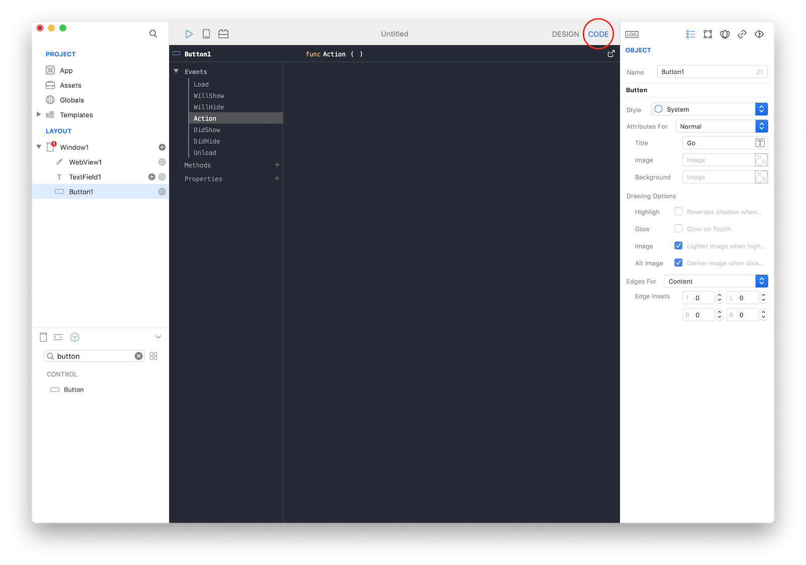
			
++9++ Code is written in **[Gravity](../gravity/getting-started.html)** programming language, which is an open source language that you can find on **[GitHub](https://github.com/marcobambini/gravity/)**.
Code required to assign two values is really simple and if you know JavaScript or Swift or any other programming language you should immediately recognize a very common pattern in this assignment.
```WebView1.url = TextField1.text;```
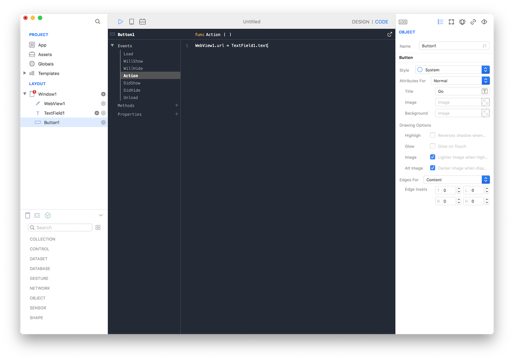
This code is executed every time a user presses the Go button.

			
Your first **Creo** app is finished and you can now executes it inside the **[Creo Simulator](../creo/runtime-mode.md)**, or send it to **[CreoPlayer](../creo/creoplayer.md)** or **[build an app](../creo/build-your-app.md)** ready to be submitted to the App Store.

#### Finishing your application		

++10++ If you try to execute your application inside **[Creo Simulator](../creo/runtime-mode.md)** you'll notice that when you press the Go button the Keyboard is not correctly dismissed:
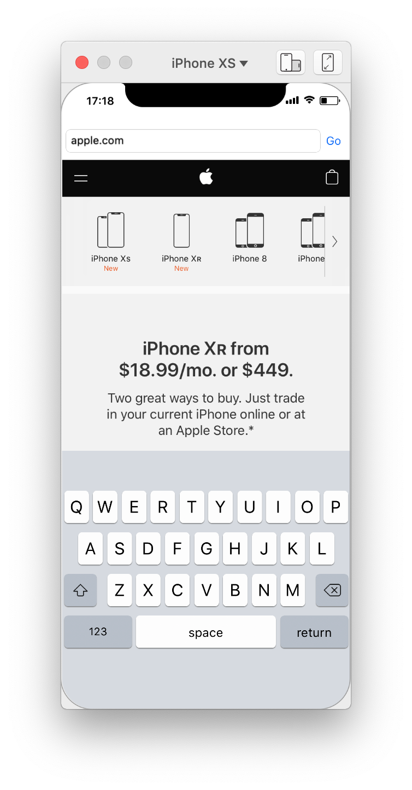

++11++ This small issue can be fixed with a line of code:
```Keyboard.hide();```
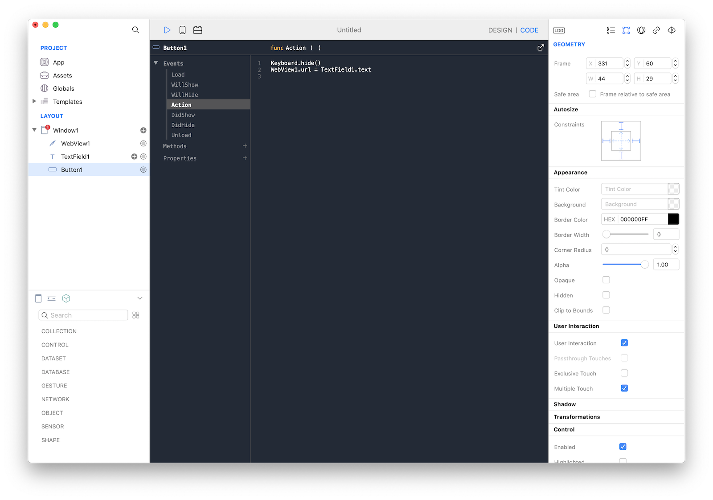
Run your project again and you'll notice that everything works as expected now.

++12++ So far we created and tested our application only on iPhone7, what happens if you try to run your app on an iPad? Just select iPad from the Info Panel and you'll notice that there are some UI issues that need to be fixed:


++13++ Again, all these issues can be easily fixed. Switch back to iPhone7 and then apply the following constraints to the three controls:
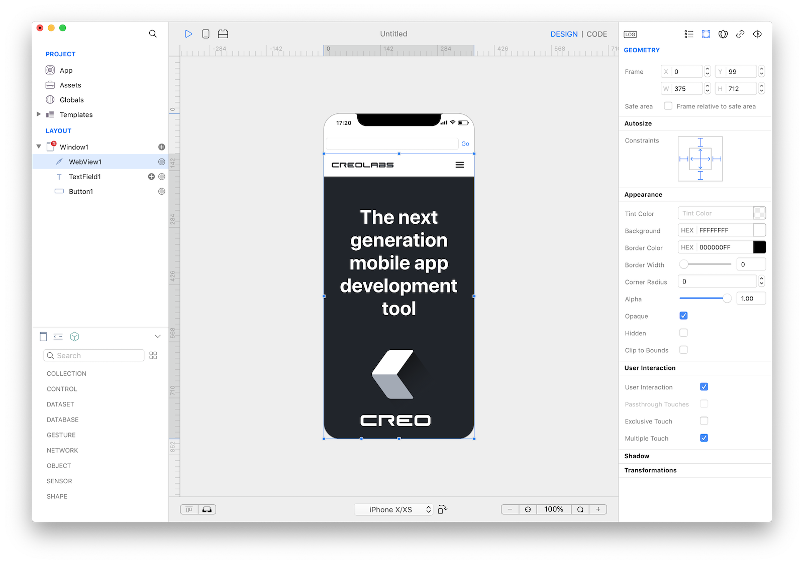
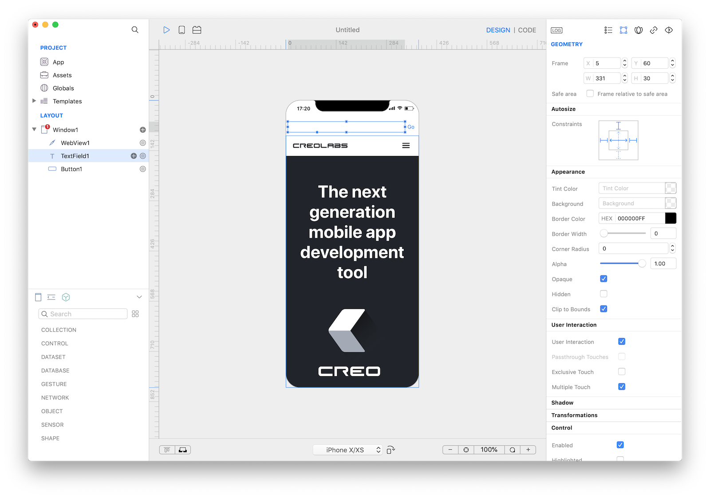
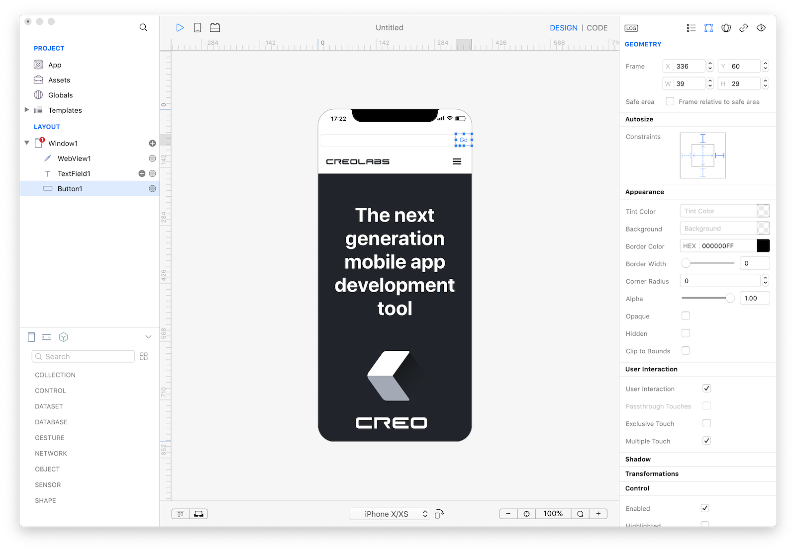

++14++ Try to select iPad again and you'll notice that everything works as expected now on all the iOS devices:
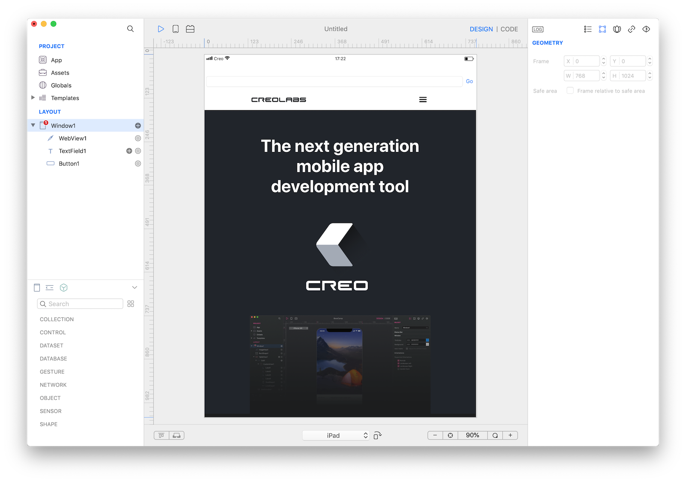

You can now send the app to **[CreoPlayer](../creo/creoplayer.md)** or **[build it](../creo/build-your-app.md)** and then submit to the App Store.


#### Project
* [Browser.creoproject](../assets/browser.zip) (12KB)