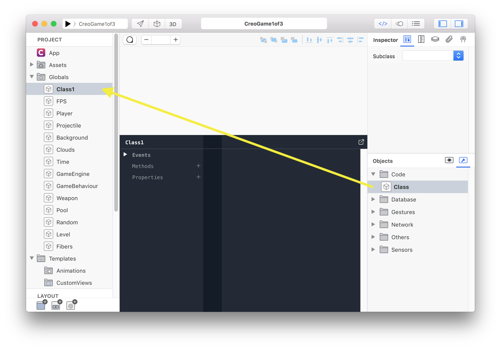
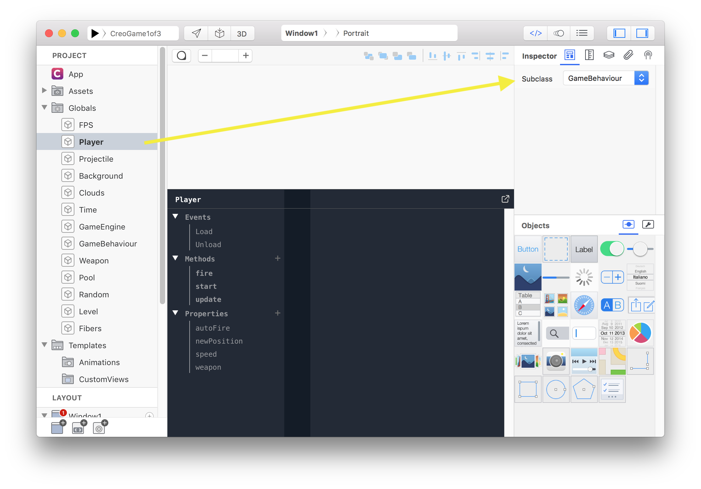

++Concepts++

==Tutorial==

--1--

We start building a little and generic game engine, making use of some advanced topics from Gravity:
1. Threads with Fibers
1. Object-oriented programming
1. Closures
1. Bind

From Creo we use
1. Adding Views at runtime
1. Timer
1. PanGesture
1. Sound
1. MapView

Pre-requisites:
1. Being able to create a simple Creo project
1. Basic object oriented programming skills are required

Tutorial 1 of 3 goals:
1. Creating a "game like" updating loop, using Fibers and Closures
1. Presenting a generic GameBehaviour Gravity class that can be inherited to build specific game objects
1. Creating an animated background using the MapView


### Concepts

### Closures
A closure is an anonymous function that can be defined and used like a variable; an important aspect of a closure is the possibility to access the scope of the surrounding variables of its definition.

ie.
```swift
var frame = 0
var update = { frame = frame + 1 }
update()
Console.write(frame)
```

you can also pass parameters to the closure

ie.
```swift
var frame = 0
var update = func(inc) { frame = frame + inc }
update(10)
Console.write(frame)
```

Please note:
when the closure is defined inside a class method and later used to access class methods or properties the implicit `self` may not be what expected. Use the function `bind` to avoid this situation.

```swift
class Parent {
    var update = null
    var frame = 0

    func init() {
        update = { frame = frame + 1 }.bind(self)
    }
}

...

var Parent()
var update = parent.update
update()
```

### Fibers
Fibers are user-space threads without a scheduler; a Fiber can yield and resume its execution from the place it has exited.
A Fiber is created with `create`:

ie.
```swift
 Fiber.create( {
   Console.log("/(self) is the current fiber")
 })
 ```
 
 and executed till the next `yield` with `fiber.call()`

ie.
```swift
var closure = {
    Console.log("1")
    Fiber.yield()

    Console.log("2")
    Fiber.yield()

    Console.log("3")
    Fiber.yield()

    Console.log("Done")
}

var fiber = Fiber.create(closure)

fiber.call()
// prints 0

fiber.call()
// prints 1

fiber.call()
// prints 2

fiber.call()
// prints Done

Console.log(fiber.isDone())
// prints true
```

There are 2 types of yield:
1. `Fiber.yield()` it returns the controll to the function calling `call()`
1. `Fiber.yieldWaitTime(seconds)` it returns the controll to the function calling `call()` and also store the current time internally.

The later enable a call check of the total time in seconds passed since last `call()`. If the time amount is not enough the call is void and the fiber is not entered.

Example:

To implement a function that do some stuff every second, like a timer, a way is to use `Fiber.yieldWaitTime(seconds)`
```swift
var fiber = Fiber.create({
  var keepGoing = true
  while (keepGoing) {
    keepGoing = doSomeStuff()
    Console.write("Waiting")
    Fiber.yieldWaitTime(1.0)
    Console.write("Elapsed time: \(self.elapsedTime())")
  }
})

...
// Note: this strict loop is just for reference, not a real case.
while (!fiber.isDone()) {
  fiber.call()
}

```

### Bind
In Creo+Gravity there are 2 types of `bind` methods that can be used.
1. is to bind an object event to a function/closure
1. is to bind the implicit `self` of a closure to a value

The first is used when an object (ie a `Timer`) emit an event like `Action` and, in response, we need to run our code.

ie
```swift
var timer = Timer(1.0/100.0, true)
var action = { Console.log("Timer fired") }
timer.bind("Action", action)
timer.start()

...

"Timer fired" is printed every 0.01 sec

```

The second use of `bind` is to ensure the linking of an implicit `self`, inside a closure, to the needed object. See **Closures**

## Part I - GameEngine and animated background

### Basic game loop
Game objects usually have some kind of logic that needs to be updated each frame to simulate some kind of behaviour.
For instance a missile moves a small step toward a direction each frame; we want this update to be called as often as possible to generare as much frames as possible. The more frames per second we have the better feeling a game produces for the player and the place where this updating is done is usually called **game loop**.

Inside Creo there is no such loop, so we have to create our own.
At the core of our game engire there is a Timer fired every 0,01 seconds. The idea behind is to register a Fiber for each "game objects update function" and execute it from the timer function. By calling it so often we can simulate movements or other complex beheaviours.

**Note:** Gravity/Creo has no Fiber scheduler integrated, this is why we need to simulate one using a timer.

### 1. Class Fibers

Our first class is used to:
1. store all fibers created by the game logic
1. execute all of them each time the timer is fired

Once a fiber `isDone()` is removed from the array and no longer called.
The main method to add a new fiber is `startManaged(closure)` and the parameter is the Fiber closure.

**Note**: the closure has to be a function that accept a parameter because it will receive the fiber associated as a parameter.

To create new class: 

1. drag `Class` from the objects `Code` to `Globals`
1. click on it and press Enter to rename



```swift
class Fibers {
  public var fibers
  public var timer

  func init() {
    Console.write("Fibers scheduler started")
    fibers = []
    timer = Timer(1.0/100.0, true)
    timer.bind("Action", { self.timerAction() })
    timer.start()
  }

  private func start(fiber) {
    fibers.push(fiber)
  }

  func startManaged(closure) {
    var fiberClosure = {
      // Inside a fiber closure `self` is bound to the fiber instance
      closure(self)
    }
    var fiber = Fiber.create(fiberClosure)
    start(fiber)  
  }

  private func timerAction() {
    var remove = []
    var index = 0

    for (var fiber in fibers) {
    	var status = fiber.isDone()

    	if (status == false) {
    		fiber.call()
    	} else {
    		remove.push(index)
    	}

    	index = index + 1
    }

    while (remove.count != 0) {
    	fibers.remove(remove.pop())
    }  
  }
}
```

### 2. GameEngine

To store an instance of the new `Fibers` class and create the base for a game loop we add a new class called `GameEngine`. It offers the main method to add fibers through a new class called `GameBehaviour`.

```swift
class GameEngine {
  public var fibers = Fibers();
  
  // instance must be a GameBehaviour object
  func addInstance(instance) {
    var closure = func(fiber) {
    	instance.engine = self
    	instance.start()
    	Fiber.yieldWaitTime(0.0)

    	while (instance.destroy === false) {
    		Fiber.yieldWaitTime(1.0/100.0)
    		instance.time.deltaTime = fiber.elapsedTime()
    		instance.update()
    	}

    	instance.onDestroy()
    }
    fibers.startManaged(closure)
  }
}
```

### 3. GameBehaviour

A `GameBehaviour` is the base class from which every game object derives. It's usually connected to a `View` but is not necessary; for instance a behaviour could play a sound or do other things that do not require a view.

When you use `GameBehaviour` you have to explicitily derive from it

 

The `GameBehaviour` has 3 important methods:

1. `start` is called by `GameEngine` once on the frame before the `update` functions is called the first time
1. `update` is called every frame until the flag `destroy` is set to `true`
1. `onDestroy` is called once when the the flag `destroy` is set


```swift
class GameBehaviour {
  // Set to true to kill this behaviour
  public var destroy=false;

  // The parent `GameEngine` instance
  public var engine;

  public var location {
    get {
      var hw = view.frame.width / 2.0
      var hh = view.frame.height / 2.0
      return Point(view.frame.x + hw, view.frame.y + hh);
    }
  
    set {
      var hw = view.frame.width / 2.0
      var hh = view.frame.height / 2.0
      view.frame.x = value.x - hw;
      view.frame.y = value.y - hh;
    }
  };

  // helper variable to interact with time
  public var time=Time();

  // the associated View (if present)
  public var view = null;

  // called once, use it to initialize your View and stuff
  func start() {
  }

  // called every frame
  func update() {
  }

  // called when `destroy = true`
  func onDestroy() {
    Console.write("onDestroy")
  }

}
```

### 4. Time 

For keeping a smooth experience for the player the time in seconds it took to complete the last frame is available with `time.deltaTime`.

```swift
class Time {
  public var deltaTime=0.0;
  func since(value) {
    var delta = time() - value
    return delta
    
  }
  func time() {
    return System.nanotime() / 1000000000.0
  }
}
```

Use this value to make your game frame rate independent.

ie.
```swift
class ExampleClass : GameBehaviour {
  public var direction=Point(0.0, -1.0);

  func update() {
    var x = location.x + direction.x * time.deltaTime
    var y = location.y + direction.y * time.deltaTime
    location = Point(x, y)
  }
}
```

We are now ready to start building the game itself.

### 5. GameEngine instance

1. start with an empty project and add a Window
1. add `Fibers` `GameEngine` `Time` `GameBehaviour` classes
1. under the window properties add a new variable `gameEngine = GameEngine()`

### 6. GameBehaviour: Background and Level

1. create a 2 new classes, name it `Level` and `Background`; both subclass `GameBehaviour`
1. add a `MapView` name it `LayerBackground`; from the inspector configure the map:
  - set constraints to fill the whole window space
  - disable user interaction
  - set `Satellite` map type and zoom level to 6.5 (the closer to street level the faster it scrolls)
  - pick an address; this is going to be your game background so any some fancy location will work
1. add `gameEngine.addInstance(Level())` in you Window `DidShow` event

```swift
class Background : GameBehaviour {
  public var speed=0.0015
  func start() {
    view = Window1.LayerBackground
  }
  func update() {
    view.latitude = view.latitude + speed*time.deltaTime
  }
}

class Level : GameBehaviour {
  func start() {
    engine.addInstance(Background())
  }

  func update() {  
  }
};
```

Play **Run**, if everything is correctly configured you should see the MapView scrolling. 

Well done! you have your first `GameBehaviour` properly receiving updates from the `GameEngine`.

Next tutorial: player ship, generated background and fire pool!
