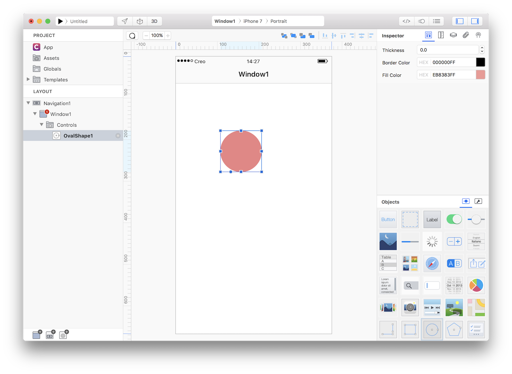
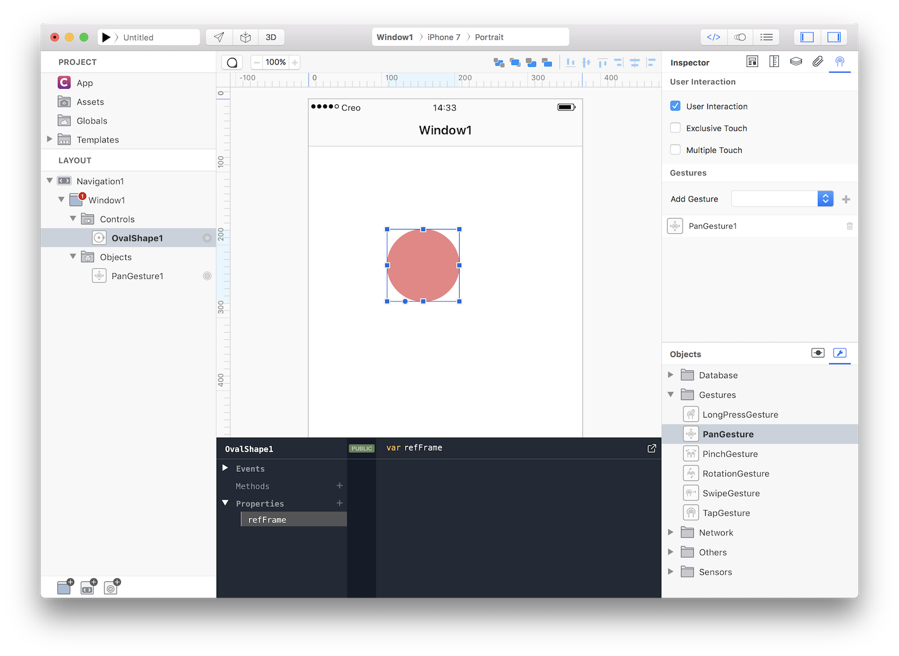

#### Concepts
A gesture-recognizer object decouples the logic for recognizing a sequence of touches (or other input) and acting on that recognition. When one of these objects recognizes a common gesture or, in some cases, a change in the gesture, it sends an action message to each designated target object.

#### Classes
* [OvalShape](../classes/OvalShape.md)
* [PanGesture](../classes/PanGesture.md)

#### Assets
* None

#### Steps
++1++ Create a new empty Creo project and drop a OvalShape object into the Design Board. Then change its thickness to 0.0 and set a fill color you like:


++2++ Drop a PanGesture object from the Gestures objects into Window1:


++3++ Now select your OvalShape1 object and go to the Gesture inspector panel. Check the "User Interaction" flag and connect the gesture PanGesture1 to the OvalShape1 object (pressing the + button):


++4++ We now have PanGesture1 bound to the OvalShape1 object, so lets configure the gesture now. We need a property to store a temporary value so the first thing to do is to add a public refFrame property to the OvalShape1 object. Just select it, open the Code Editor and add that property:


++5++ Now select the PanGesture1 object and in its Action even write the following code:

```
// at the began of the gesture, save the original frame into an object property
if (self.state == GestureRecognizerState.Began) {
	OvalShape1.refFrame = OvalShape1.frame.copy();
	return;
}

// each time the gesture state changes, copy the new frame to a temporary variable
// (remember that in Gravity everything is an object but in this case we need to
// explicitly make a copy), then translate absolute coordinates to coordinates
// local to the Window1 and finally apply the changes to the OvalShape1 frame (to
// move the original object)
if (self.state == GestureRecognizerState.Changed) {
	var frame = OvalShape1.refFrame.copy();
	var t = self.translationInView(Window1)
	frame.x += t.x;
	frame.y += t.y;
	OvalShape1.frame = frame;
}
```

++6++ That's all you need in order to have a fully functional Assets browser app. Press RUN and enjoy the app!


You can now send the app to **[CreoPlayer](../creo/creoplayer.md)** or **[build it](../creo/build-your-app.md)** and then submit to the App Store.

#### Project
* [GestureRecognizer.creoproject](../assets/gesture.zip) (12KB)
