#### Concepts
So far in the tutorials we have used DataSet from a variety of sources. From a Database in the <a href="lets-cook-nav.html">LetsCook</a> tutorial, to a REST service in the <a href="spotify.html">Spotify</a> tutorial and from an images folder in the <a href="ebook.html">eBook</a> example. In this example we'll show use how easily can be to use a Bluetooth device that usually requires a large amount of code. We then extend the example to include a nice animation.For this tutorial you need a Heart Monitor Bluetooth device (we are using a **Polar H7 Bluetooth Heart Rate Sensor** but any other Bluetooth device can be used. As an alternative you could also install **[LightBlue](https://itunes.apple.com/us/app/lightblue-explorer-bluetooth/id557428110?mt=8)** to simulate any Bluetooth LE device and service.

#### Classes
* [BTCentral](../classes/BluetoothCentral.md)
* [Label](../classes/Label.md)
* [ImageView](../classes/ImageView.md)
* [Animation](../classes/Animation.md)
		
#### Assets
* None
		
#### Steps
++1++ Create a new empty Creo project and start by dragging a BTCentral class from Objects (Network group) to Window1. A Bluetooth Central configurator panel will show up and will let you choose the service you want to use:
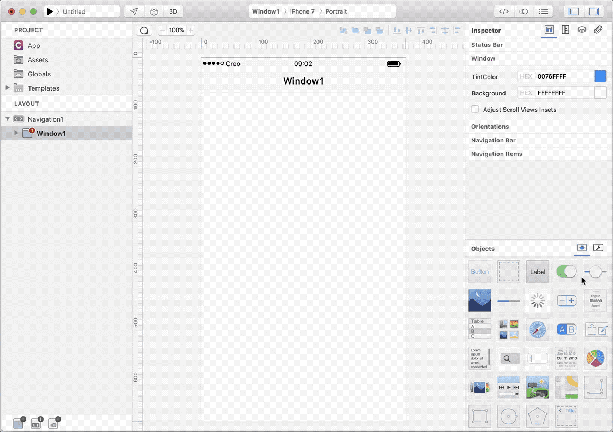
In this tutorial we are interested in the **Heart Rate Measurement** service.

++2++ Now drop a Label into Window1 and set its typography properties:
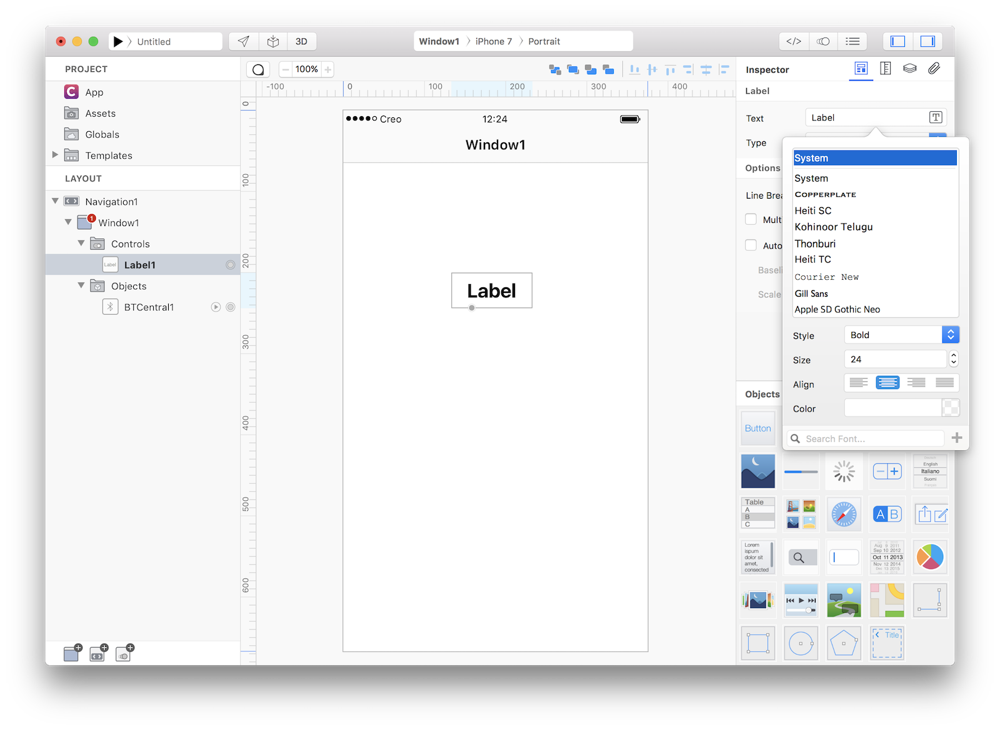

++3++ Use a Binding to connect the value received from the Bluetooth configured service to the Label1.text property:
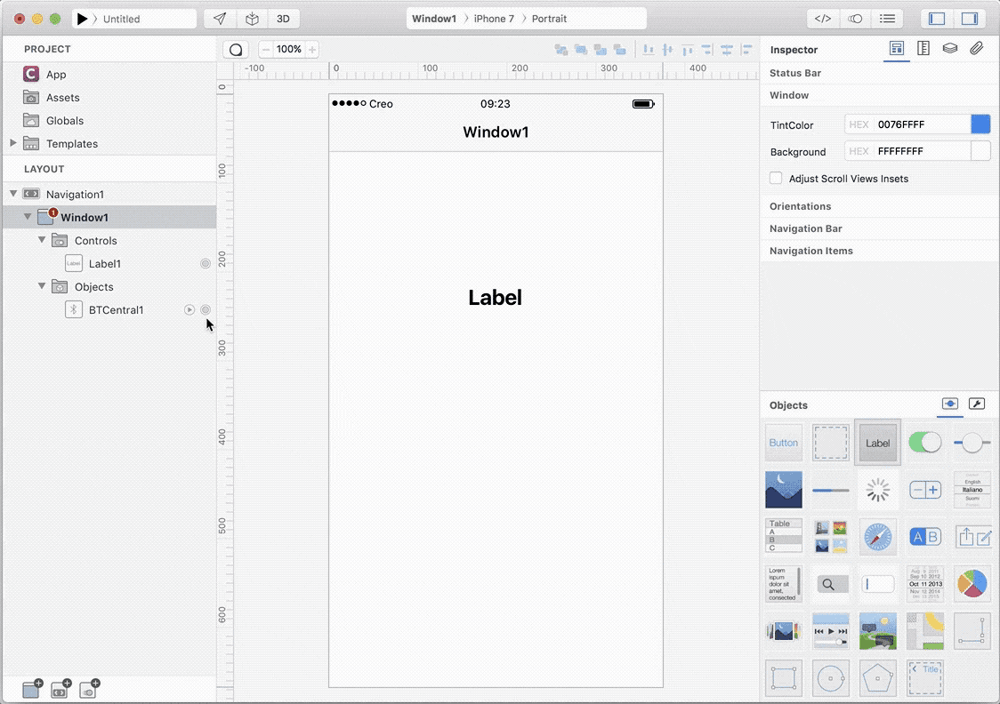
**IMPORTANT**
Decoding a Bluetooth value involves some programming skills but Creo offers built-in encoding/decoding for most common services via the special **decodedValue** property. If the service is not covered by Creo or if it is a custom value then you should use the raw **data** property. If you need to perform a custom decoding then you could use the BTCentral NewValue event or the Binding SourceConversion event. For more information about Bluetooth services and values you can consult the **[official documentation](https://www.bluetooth.com/specifications/gatt/services)**</a>.

++4++ If you press Run you'll see the value of the Heart Rate device displayed into Label1:
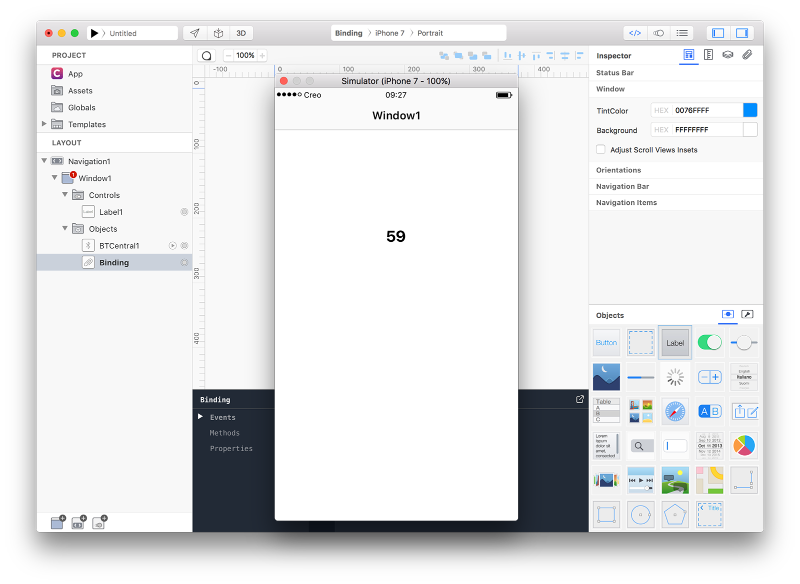

++5++ Add a nice Animation to our app. Start by dragging an ImageView in Window1. Then in the Layout panel drag the Label1 below ImageView1 (this changes the z-axes of the controls and will display ImageView1 below Label1):
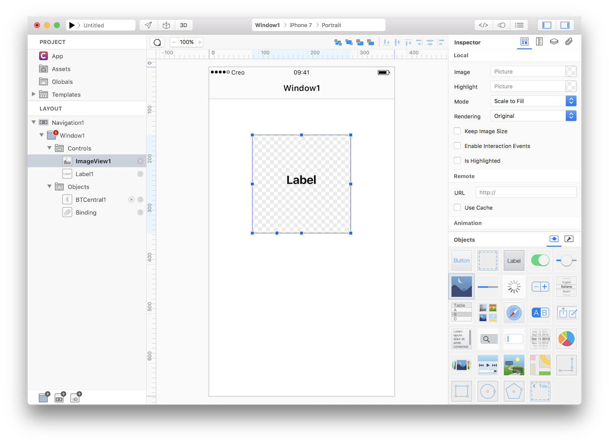

++6++ Set the Image property of the ImageView1 to a nice Heart picture:
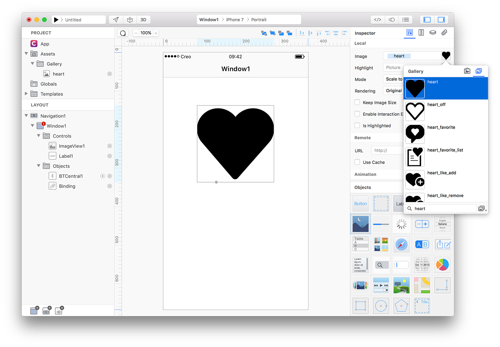

++7++ Heart should be red and not black. So change the Rendering inspector property to "Tinted" and then change control Tint Color to "red":
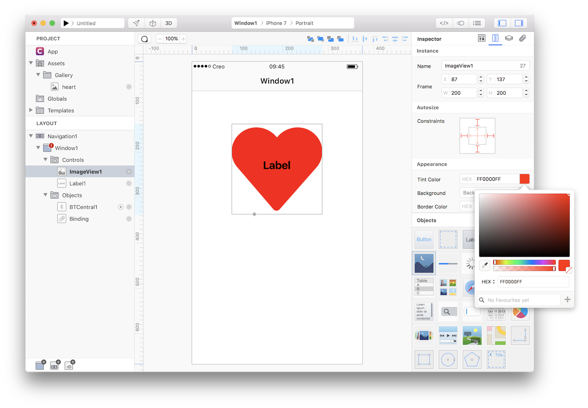

++8++ Change Label1 color to white in its typography settings:
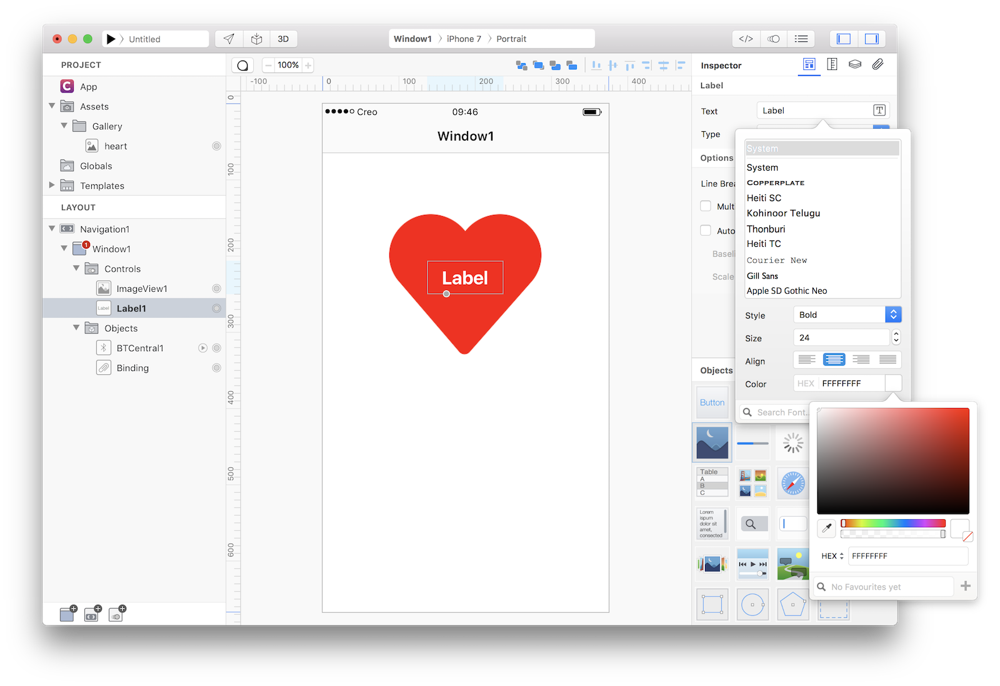

++9++ Create an Animation object. What we are going to animate is the scale property of the ImageView1 control. This can easily be done with the built-in animation editor:
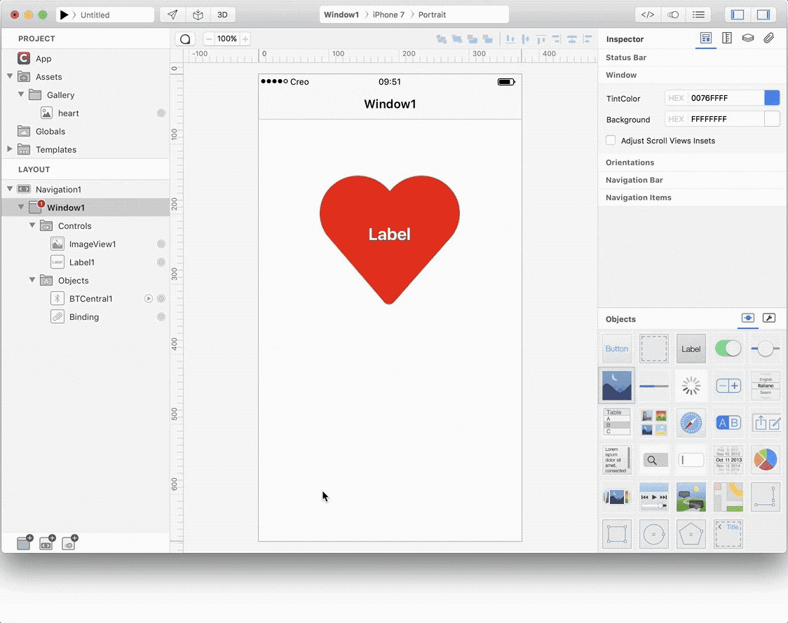

++10++ You can preview the animation directly from the Animation Editor:
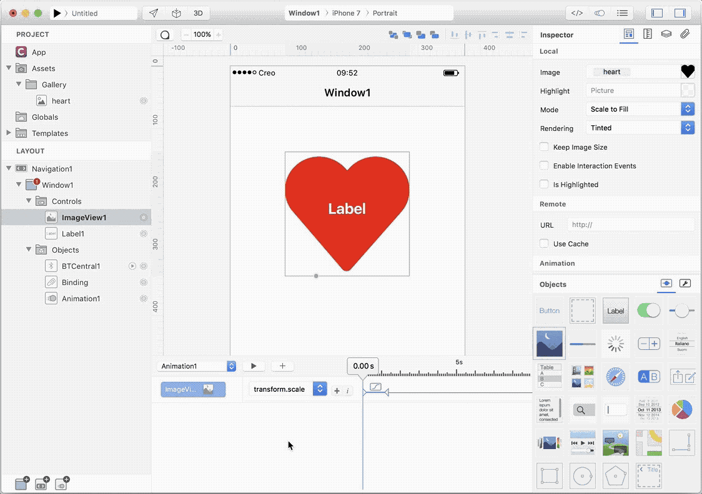

++11++ Animation is an object like everything else inside Creo, with its own methods and properties. We'd like to have the Animation to start automatically and to play forever so, write the following code in Window1.DidShow event (to automatically start the animation) and to Animation1.Completed event (to repeat the same animation forever):
```
Animation1.play();
```

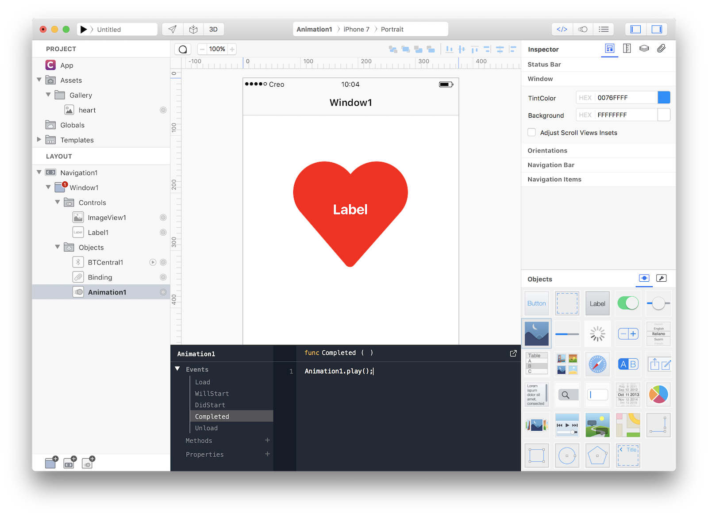

++12++ Press RUN and enjoy the HeartRate app!
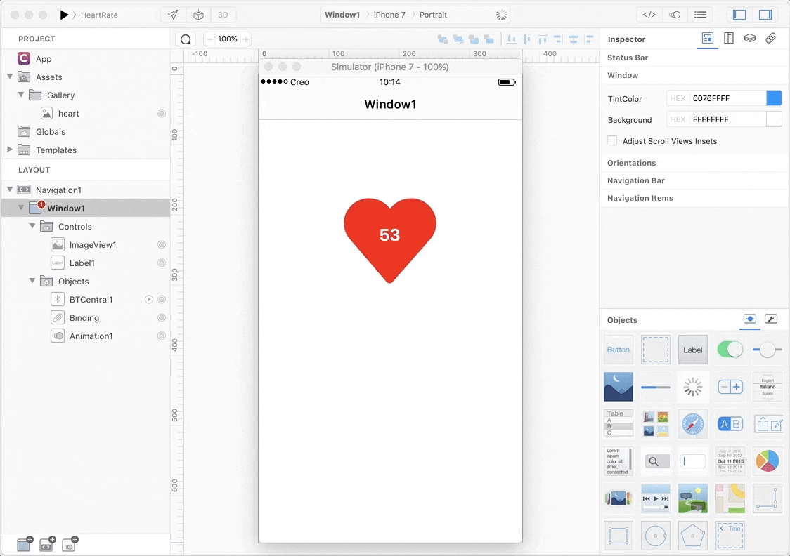

		
You can now send the app to **[CreoPlayer](../creo/creoplayer.md)** or **[build it](../creo/build-your-app.md)** and then submit to the App Store.

#### Project
* [HeartRate.creoproject]({{github_raw_link}}/assets/heartrate.zip) (84KB)

