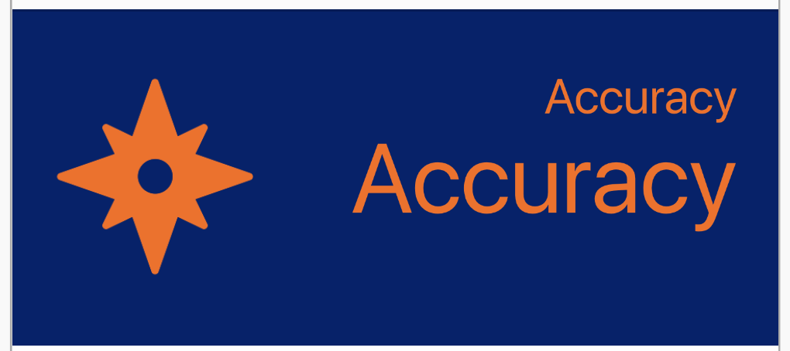
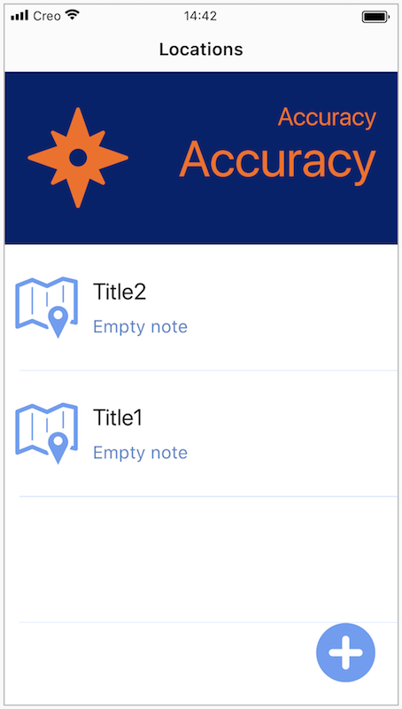
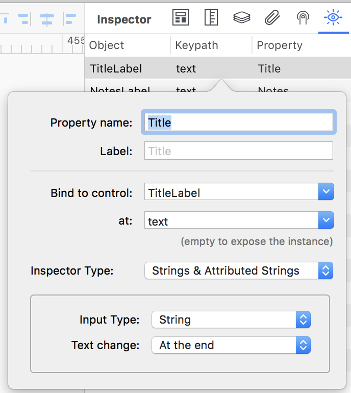

#### Concepts
The Parking Car tutorial will show you how to navigate between two windows (using a Navigation Bar), integrate the GPS object, load and save data into a SQLite database. A first window will show a list of locations inside a TableView and a second window will show the details of the selected location item. The second window also allow to edit the location item and save changes to the database.

#### Classes
* [Window](../classes/Window.md)
* [MapView](../classes/MapView.md)
* [ImageView](../classes/ImageView.md)
* [TableView](../classes/TableView.md)
* [TextField](../classes/TextField.md)
* [TextView](../classes/TextView.md)
* [SQLite Database](../classes/SQLiteDatabase.md)
* [SQLite RecordSet](../classes/SQLiteRecordSet.md)
* [GPS](../classes/GPS.md)
* [View](../classes/View.md)	
		
#### Assets
* Compass (compass) Image
* MapLocation (map_location) Image
* AddNewPlus (add_new_plus) Image

#### Steps
++1++ Create a new empty Creo project and start by dragging a new SQLite database into the Globals folder, from the opened dialog select Assets, click on the plus button, insert the Database name, click Create File and than click Save. Open the database configurator double clicking over the Database item inside the Assets folder, than create a new table named Location. In the right area of the configuration you can add fields to your Location table. Adds the following fields configured as the following example than click Save.
```
Name			Type			Constraints
ID			INTEGER			PA
Date			TEXT			
Title			TEXT
Notes			TEXT
Latitude		REAL
Longitude		REAL
```

++2++ Create a new database query object by using the contextual menu over the previously created database. In the Query Editor just drag the Location table into the SQL edit field and the sql query will be automatically created for you (you can also manually enter it). You can optionally press the Run button to test the result of your query (data in the instructions column is in Markdown format). The SQL query looks like:
```SELECT * FROM "Location" ORDER BY "Date";```

++3++ From the Objects inspector panel drag a Class object into the Globals folder and rename it to LocationInfo name. From the Code Editor add new properties named date, latitude, longitude, notes and title.

++4++ From the Objects inspector panel drag a GPS object into the Globals folder and rename it to GPS1 name. From the Code Editor insert into the NewValue event the code below: 
```
var accuracy = "" + Int(value.location.horizontalAccuracy) + " meters"
ListsWindow1.Display1.AccuracyValueLabel.text = accuracy
```

++5++ From the Objects inspector panel drag a Class object into the Globals folder and rename it to DataSource name. 

++6++ From the Code Editor add a new method named addLocation with the following source code:
```
Signature: addLocation ( locationInfo )

Source Code:
var date = locationInfo.date
var title = locationInfo.title
var notes = locationInfo.notes
var latitude = locationInfo.latitude
var longitude = locationInfo.longitude
var sql = 'INSERT INTO Location (date, title, notes, latitude, longitude) VALUES ("\(date)", "\(title)", "\(notes)", "\(latitude)", "\(longitude)")'
Database.execute(sql)
```

++7++ From the Code Editor add a new method named locationCount with the following source code:
```
Signature: locationCount (  )

Source Code:
var sql = 'SELECT * FROM Location'
var recordSet = Database.select(sql)
return recordSet.rowCount
```

++8++ From the Code Editor add a new method named locationWithID with the following source code:
```
Signature: locationWithID ( locationID )

Source Code:
var sql = 'SELECT * FROM main."Location" WHERE ID="\(locationID)";'
var recordSet = Database.select(sql)
recordSet.moveFirst()

var locationInfo = LocationInfo()
locationInfo.date = recordSet.Date
locationInfo.title = recordSet.Title
locationInfo.notes = recordSet.Notes
locationInfo.latitude = recordSet.Latitude
locationInfo.longitude = recordSet.Longitude

return locationInfo
```

++9++ From the Code Editor add a new method named removeLocationWithID with the following source code:
```
Signature: removeLocationWithID ( locationID )

Source Code:
var sql = "DELETE FROM Location WHERE id = \(locationID)"
Database.execute(sql)
```

++10++ From the Code Editor add a new method named updateLocation with the following source code:
```
Signature: updateLocation ( locationInfo, locationID )

Source Code:
var sql = 'UPDATE Location SET date="\(locationInfo.date)", title="\(locationInfo.title)", notes="\(locationInfo.notes)", latitude="\(locationInfo.latitude)", longitude="\(locationInfo.longitude)" WHERE ID="\(locationID)"'
Database.execute(sql)
```

++11++ From the Layout bottom panel add a new Window control into the Layout area over the Navigation1 and rename it to ListsWindow1 name.

++12++ From the Code Editor insert into the Load event of the ListsWindow1 the code below:
```
GPS1.run()
```

++13++ From the Code Editor insert into the WillShow event of the ListsWindow1 the code below:
```
// hide the old selection
var selectedRow = TableView1.selectedRow
if (selectedRow != null) {
	TableView1.deselectRow(selectedRow, true)
}
```

++14++ From the Objects inspector drag a View and name it Display1 into the ListsWindow1

++15++ From the Objects inspector drag an ImageView and 2 Labels naming respectively it ImageView1, AccuracyLabel and AccuracyValueLabel into the Display1 view. Select and layout every controls like the image below:


++16++ From the Objects inspector drag a TableView and Button naming respectively TableView1 and AddButton into the ListsWindow1 from the Layout panel. Select and layout every controls like the image below:


++17++ Select the AddButton control and from the Code Editor inside the Action event insert the following code:
```
var dataSource = DataSource()
var locationInfo = LocationInfo()
locationInfo.date = Date()
locationInfo.title = "Title" + (dataSource.locationCount() + 1)
locationInfo.notes = "Empty note"
locationInfo.latitude = GPS1.value.location.coordinate.latitude
locationInfo.longitude = GPS1.value.location.coordinate.longitude
dataSource.addLocation(locationInfo)
TableView1.reload(true)
```

++18++ Select the TableView1 control and from the Code Editor inside the DidSelectCell event insert the following code: 
```
MapWindow2.locationID = cell.identifier
Navigation1.openWindow(MapWindow2, true)
```

++19++ Select the TableView1, expand the item in order to view the inner Cell1 object, select the Cell1 object and click on the right + button and select the Custom View menu item like the image below:


++20++ From the Objects inspector drag an ImageView and two Labels naming respectively ImageView1, Label1 and Label2. Select and layout every controls like the image below:


++21++ Select the TableView1, expand the item in order to view the inner Cell1 object, select the Cell1 object and click on the right + button and select the Right Action menu item like the image below:


++22++ Select the RightAction1 object and from the Code Editor inside the Action event insert the following code: 
```
var dataSource = DataSource()
dataSource.removeLocationWithID(cell.identifier)
TableView1.reload(true)
```

++23++ Select the CustomView1 object and from the Binding panel inside the Inspector panel add 2 items like the figures below:




++24++ From the Layout bottom panel add a new Window control into the Layout area over the Navigation1 and rename it to MapWindow2 name

++25++ From the Objects inspector panel drag a View control into the Layout area over the MapWindow2 and rename it to Container name

++26++ From the Objects inspector drag a 3 Labels, a TextField and a TextView and naming respectively DateLabel, TitleLabel, NotesLabel , TitleTextField and NotesTextView and drop over the previously created Container view. Select and layout every controls like the image below:


++27++ From the Objects inspector panel drag a MapView control into the Layout area over the MapWindow2 and rename it to MapView1. Select and layout every controls like the image below:


++28++ Select the MapWindow2 object and from the Code Editor insert into the DidShow event the code below:
```
var dataSource = DataSource()
locationInfo = dataSource.locationWithID(locationID)
Container.DateLabel.text = locationInfo.date
Container.TitleTextField.text = locationInfo.title
Container.NotesTextView.text = locationInfo.notes
MapView1.latitude = locationInfo.latitude
MapView1.longitude = locationInfo.longitude
```

++29++ Select the MapWindow2 object and from the Code Editor insert into the KeyboardWillShow event the code below:
```
Container.animate(0.3, 0, AnimationOption.CurveEaseInOut, {
	Container.frame.y = Screen.bounds.height - Container.frame.height - keyboard.endRect.height
}, { /* no-op */ })
```

++30++ Select the MapWindow2 object and from the Code Editor insert into the KeyboardWillHide event the code below:
```
Container.animate(0.3, 0, AnimationOption.CurveEaseInOut, {
	Container.frame.y = Screen.bounds.height - Container.frame.height
}, { /* no-op */ })
```

++31++ Select the MapWindow2 object and from the Code Editor insert into the WillHide event the code below:
```
var dataSource = DataSource()
locationInfo.title = Container.TitleTextField.text
locationInfo.notes = Container.NotesTextView.text
locationInfo.latitude = MapView1.latitude
locationInfo.longitude = MapView1.longitude
dataSource.updateLocation(locationInfo, locationID)
ListsWindow1.TableView1.reload(true)
Keyboard.hide()
```

++32++ Select the MapWindow2 object and from the Code Editor add a new property named locationID

++33++ Select the MapWindow2 object and from the Code Editor add a new property named locationInfo

You can now send the app to **[CreoPlayer](../creo/creoplayer.md)** or **[build it](../creo/build-your-app.md)** and then submit to the App Store.

#### Project
* [ParkingCar.creoproject]({{github_raw_link}}/assets/parkingcar.zip) (125KB)
