#### Concepts
The ToDo tutorial implements a simple productivity app that it is able to handle tasks and subtasks. It will show you how to manage (read and write) data contained into a sqlite database and it will introduce you nice features like bindings and window's transactions.
ToDo application will have three windows. Window1 will be used to list all the main tasks from the Tasks table. Window2 will list all the subtasks related to the task selected by the user in Window1. Window3 will be used to create new task with an associated color. Window3 will be a modal window opened when the user will press the + button from the Window1 navigation bar.

#### Database
In this simple tutorial we have prepared a pre-filled sqlite database that contains two tables:
```
	Task (id INT PRIMARY KEY, name TEXT, color TEXT)
	Subtask (id INT PRIMARY KEY, task_id INT, name TEXT)
```
Each subtask is related to its main task by the task_id field. The color field in the Task table is of type TEXT because Creo has built-in color conversion capabilities between an hex string and a color.

#### Classes
* [SQLite Database](../classes/SQLiteDatabase.md)
* [SQLite RecordSet](../classes/SQLiteRecordSet.md)
* [CustomView](../classes/CustomView.md)
* [TableView](../classes/TableView.md)
* [Binding](../classes/Binding.md)
* [TextField](../classes/TextField.md)
* [View](../classes/View.md)

#### Assets
* [ToDo SQLite database]({{github_raw_link}}/assets/todo_assets.zip)

#### Steps
++1++ Create a new empty Creo project and start by dragging the todo.sqlite database into the Assets folder (then press Yes to the object conversion question).
Set the "Application Support" value for the "Copy To" property so the database file will be copied to the Application Support directory when your app is executed on a real physical device.  The Application Support directory has read-write permissions as opposed to the Assets directory which is read-only on an iOS device.
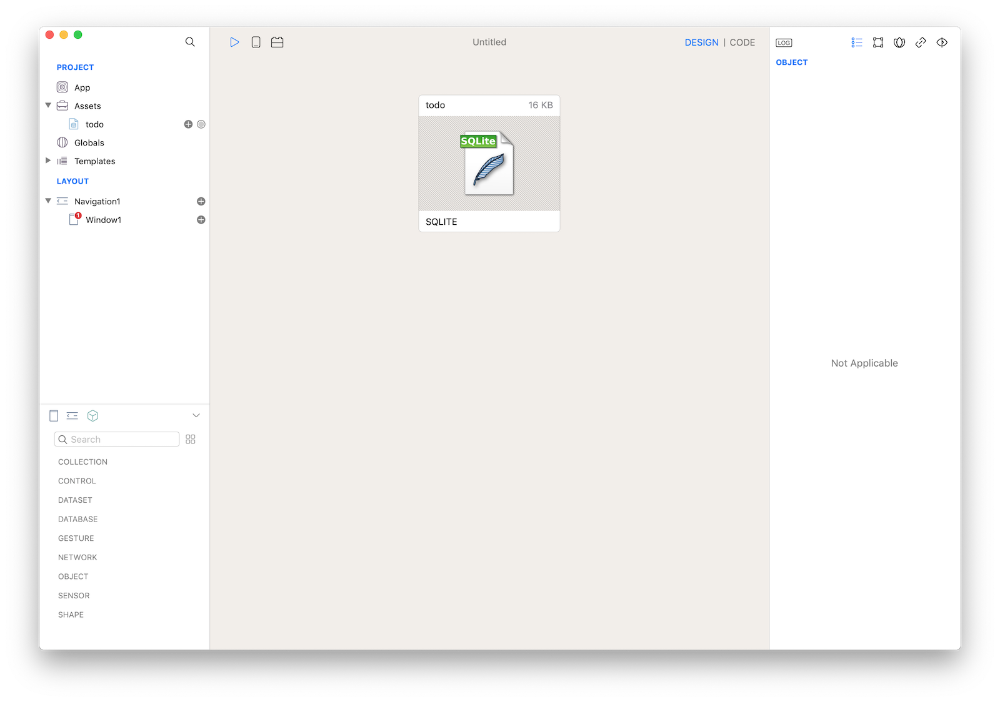

++2++ Create a new **database query** object by clicking the '+' button of the 'todo' database and then clicking on the 'Query' item of the popover menu:


++3++ Open the Query Editor by clicking on the 'Query Editor...' button in the Query1's inspector. In the Query Editor just drag the Task table into the SQL edit field and the sql query will be automatically created for you (you can also manually enter it). You can optionally press the Run button to test the result of your query:
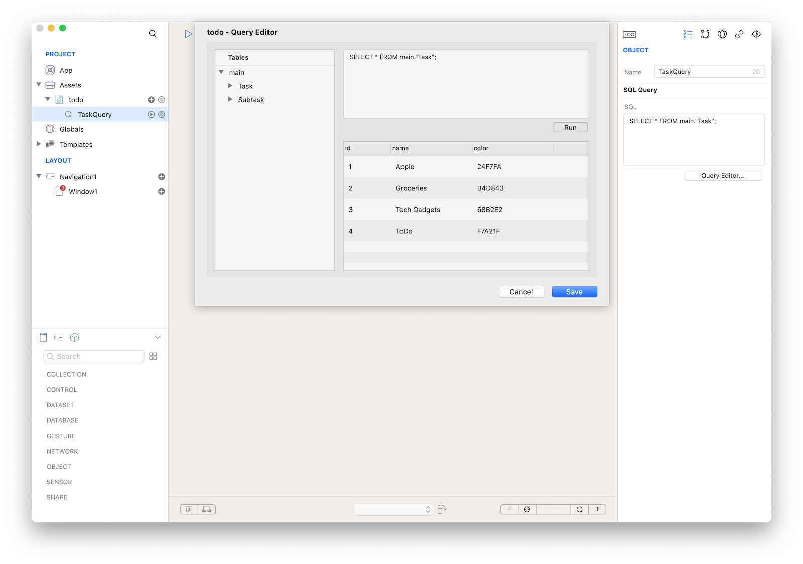

Rename Query1 to TaskQuery.

++4++ Create another **database query** object. In the Query Editor drag the Subtask table into the SQL edit field and then modify it to "SELECT * FROM main."Subtask" WHERE task_id=1;" (we use 1 as an example just to be able to visualize the query at design time) but at runtime that query will change the task_id according to user's selection):


Rename Query to SubtaskQuery.

++5++ Drag a TableView control from the Objects panel into the Window1 and resize it to be as big as the Window. The TableView automatically adjust its contentInset to show the content in the visible portion of the overall interface, if you want to change this behavior you can set a different value to the 'Adjustment' property in the 'Scroll' section of the Geometry inspector.
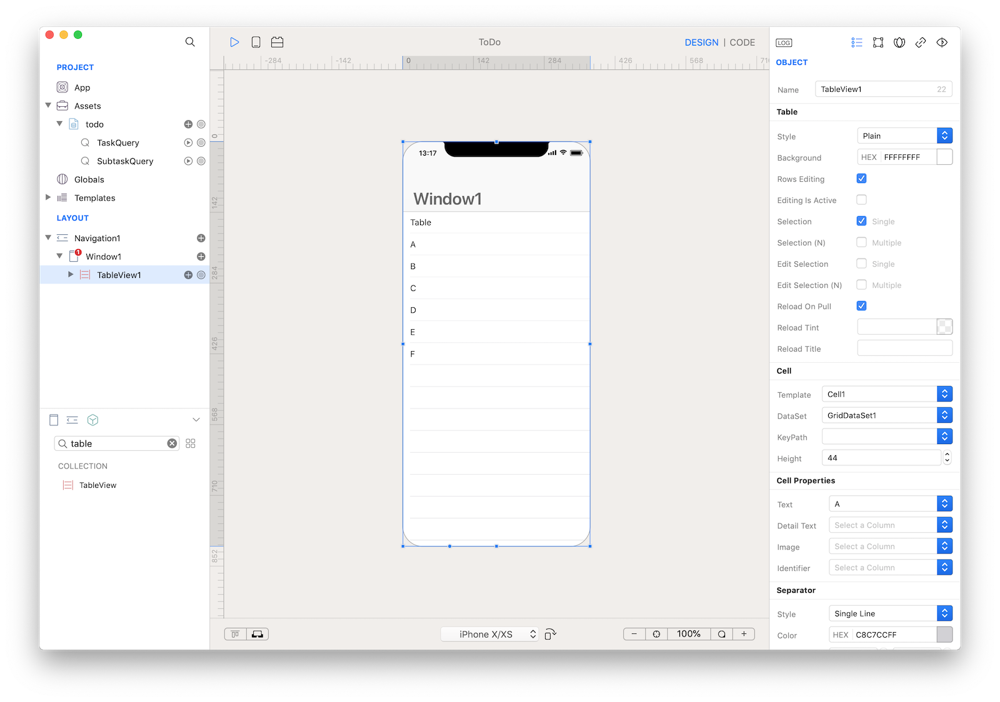

++6++ Create a CustomView inside the TableView1's template Cell1 by clicking on the '+' button on the Cell1:
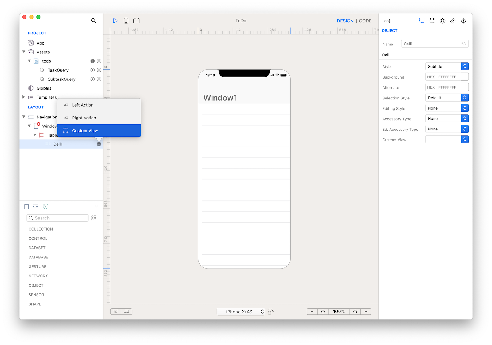

++7++ Drop a RectShape and a Label into the CustomView and apply to them the following settings from the Inspector:

| Object | Property | Value |
| ---------- | --------- | --------- |
| **RectShape1** | Frame | 6, 5, 4, 35 |
| **RectShape1** | Thickness | 0 |
| **Label1** | Frame | 16, 0, 309, 44 |

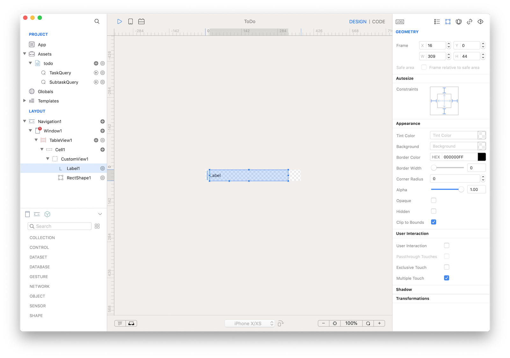

++8++ A CustomView is an object and so it can have its own properties and methods. It is now time to expose some properties. Select the Exposed Properties panel from the Inspector and drag the binding knob from the RectShape1. Configure the exposed property to be named **Color** and to be internally bound to the **RectShape1.fillColor** property:
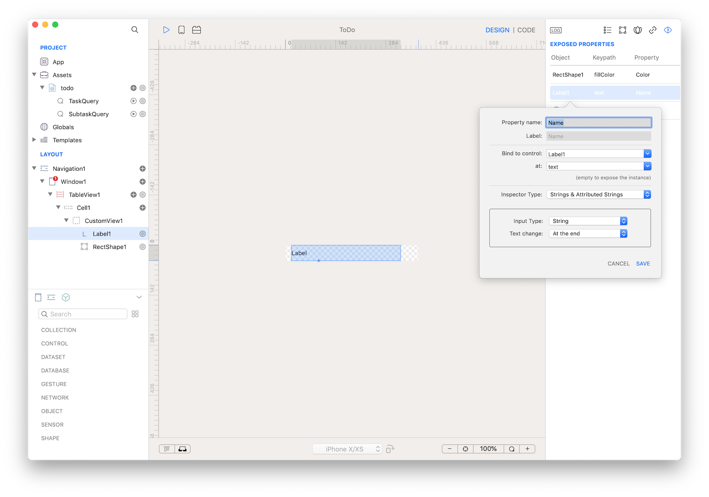

++9++ Do the same for the Label and drag the binding knob from the Label1 to the Exposed Properties Inspector. Configure the exposed property to be named **Name** and to be internally bound to the **Label1.text** property:
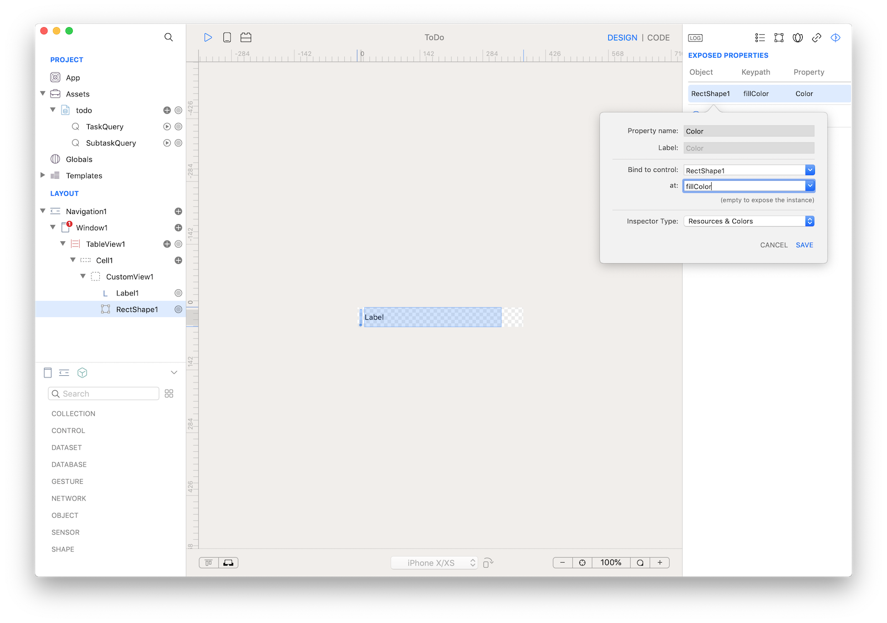

++10++ **Here is where the magic happens.** Connect your TableView with a CustomView and a DataSet. All you have to do is to configure the Custom View property of the Cell1 with the Cell1.CustomView1 value and the following properties of the TableView1:

| Object | Inspector Section | Property | Value |
| ---------- | ---------- | ---------- | ---------- |
| **TableView1** | Cell | DataSet | todo.TaskQuery |
| **TableView1** | Cell Properties | Text | <empty value> |
| **TableView1** | Cell Properties | Detail Text | <empty value> |
| **TableView1** | Cell Properties | Image | <empty value> |
| **TableView1** | Cell Properties | Identifier | id |
| **TableView1** | Cell CustomView Properties | Color | color |
| **TableView1** | Cell CustomView Properties | Name | name |

The Text, Detail Text and Image values must be empty because in this case we don't want to use the built-in subcontrols of the TableViewCell.
Identifier is a cell property that should be used to bind DataSet unique identifier, in the case of a database it is usually its primary key column.
Name and Color are the two properties you just exposed from the CustomView1, their values 'name' and 'color' are the columns of the DataSet used to get the specific values for each row.
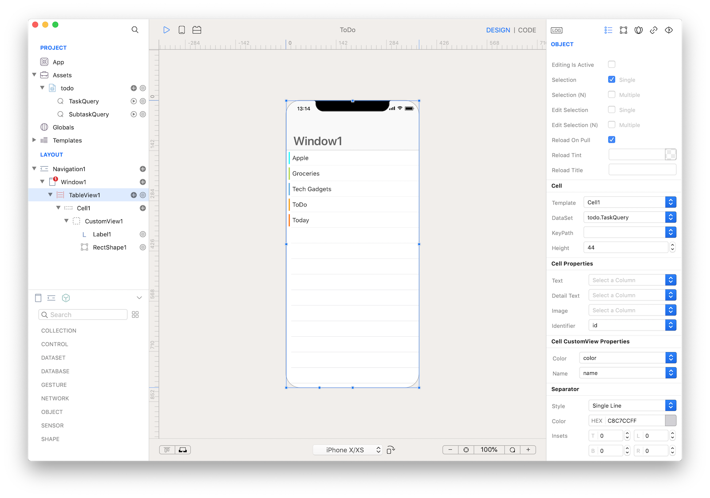

++11++ As you can see from the Navigation Bar, the Window1 title is inherited from the current window name. It would be better to have a more appropriate title. Press the + button near the Window1 item in the layout and add a customized Title Item, then change the property Title to 'ToDo'.
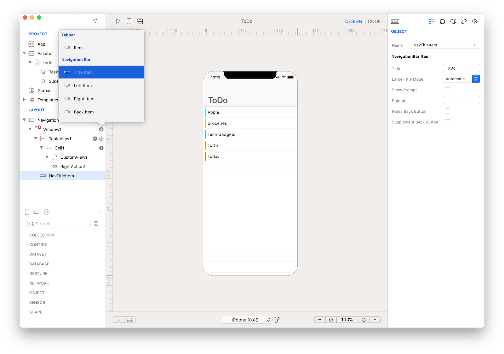

++12++ Time for NavigationBar customization. Select Navigation1 and click on the attributes icon 'T' of the Title property and set the color to 656565FF. Do the same for the Large Title property and then set the same value 656565FF for the Tint Color property (the Tint Color property affect the color of the other items of shown in the navigation bar, for example the back button).
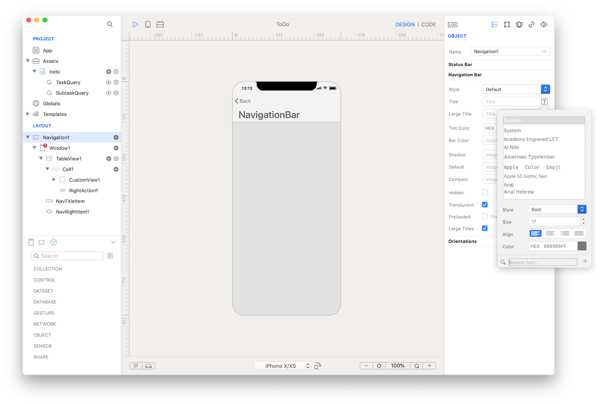

++13++ Press the + button near the Window1 item and add a customized Right Item, then select the "Add" System Item in the inspector of the NavRightItem1 object. This bar button item will be used to add a new task (ref. point #29 of this tutorial).
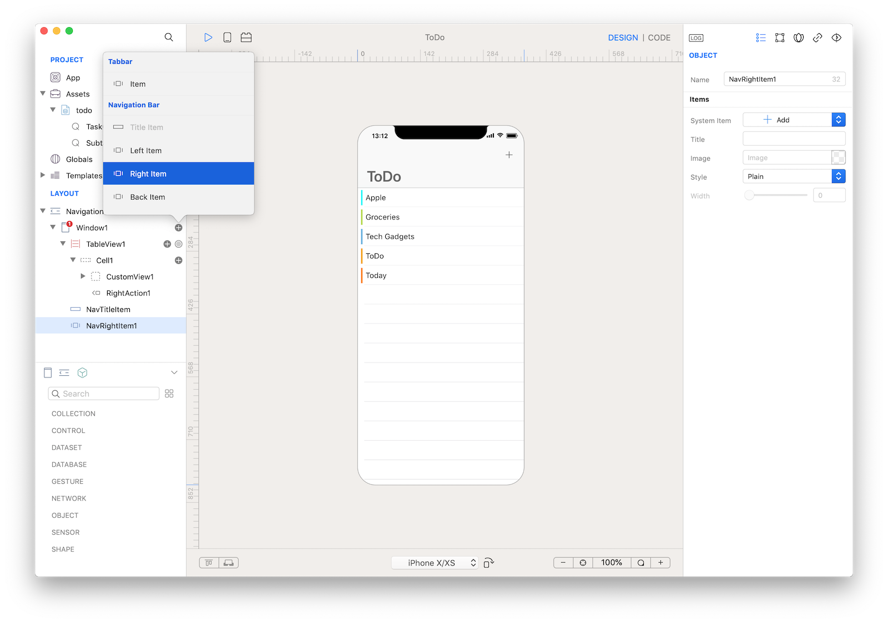

<!-- WINDOW 2 -->
++14++ The first Task window is now completed, we now need to create a window that can contains the subtasks of the selected task. Start by creating a new Window:
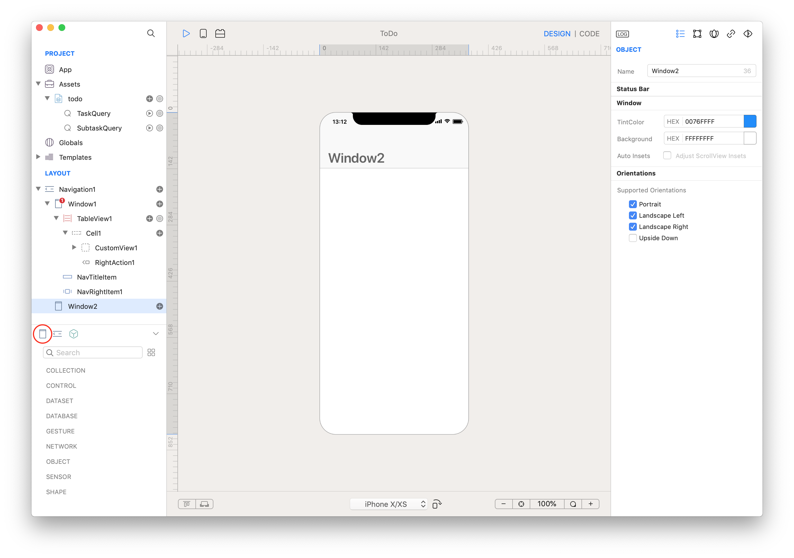

++15++ Drop a TableView (TableView1) control into Window2 and set the following properties:

| Object | Property | Value |
| ---------- | --------- | --------- |
| **TableView1** | Cell DataSet | todo.SubtaskQuery |
| **TableView1** | Cell Properties Text | name |
| **TableView1** | Cell Properties Detail Text | <empty value> |
| **TableView1** | Cell Properties Image | <empty value> |
| **TableView1** | Cell Properties Identifier | id |
| **TableView1** | Frame | 0, 0, 375, 667 |
| **TableView1** | Autosize Constraints | ```FlexibleWidth | FlexibleHeight``` |

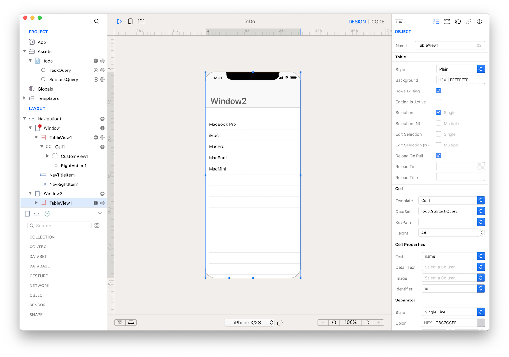

Select Window2 and change its Title by adding a custom Title Item and set the Title to 'Details'.


++16++ Now we want to add a way to create new subtasks, and we want those controls to be positioned above the table but not covered by the Navigation Bar, even on iPhone X where the bar position is different because of the notch. To do this, we can insert a TextField and a Button inside an Header view of the TableView: click on the **+** button near the TableView1 and then select the Header menu item.

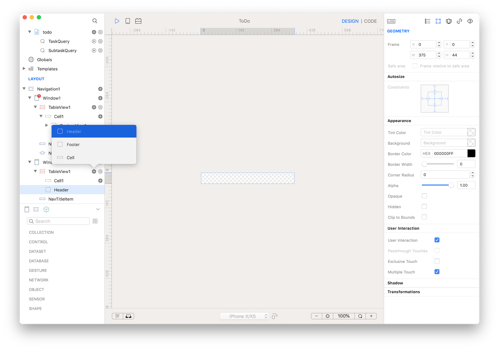

++17++ Drop a TextField (TextField1) control into Header and set the following properties:

| Object | Property | Value |
| ---------- | --------- | --------- |
| **TextField1** | Placeholder | New Entry... |
| **TextField1** | Border Style | None |
| **TextField1** | Frame | 5, 7, 317, 30 |
| **TextField1** | Autosize Constraints | FlexibleWidth |

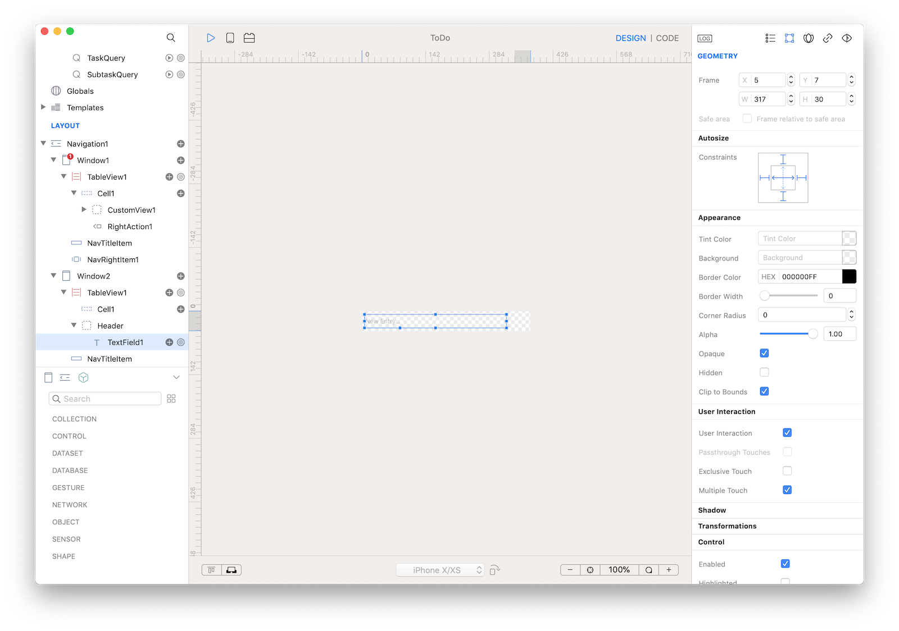

++18++ Drop a Button (Button1) control into Window2 and set the following properties:

| Object | Property | Value |
| ---------- | --------- | --------- |
| **Button1** | Title | + |
| **Button1** | Typography | Size: 18, Color: #C0C0C0 |
| **Button1** | Frame | 339, 0, 35, 44 |
| **Button1** | Autosize Constraints | FlexibleLeftMargin |

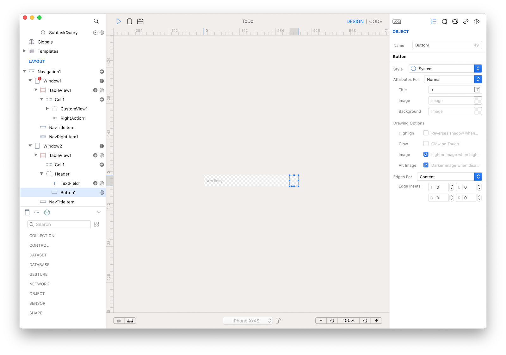

++19++ So far so good but there are some important steps missed out from our tutorial. A way to connect user's selection in Window1 to sub-tasks details in Window2, a way to create new subtasks and a way to remove a subtask from the list. Let's start from the beginning.
What we would like to achieve is to list all the subtasks related to the task the user selected in Window1, so we need a way to tell Window2 what task the user selected. A Window is an object (like any others in Creo) that can have methods and properties and a property is what we really need here. Start by selecting Window2 and then open the Code Editor.
To create a new property press the **+** button near the Properties label. A var1 **property** is created, rename it to **identifier** (editing its name near the var label).


Window2 object has now an **identifier** property that you can access via code using the dot notation: **Window2.identifier**. This property will be used to store the identifier of the selected task from Window1.

++20++ We now need to find a way to be notified every time a user selects a row into a TableView. If you read the [TableView](../classes/TableView.html) documentation you can see that it has a **DidSelectCell** event. So, select TableView1 inside Window1, expand the Events tab and select the DidSelectCell event.The first parameter is the cell that the user selected and it has an identifier property (bound to the query identifier in this case). Write the following code to set Window2 identifier property and to open Window2 inside the current navigation (if any):
```
Window2.identifier = cell.identifier;
Window2.open();
```

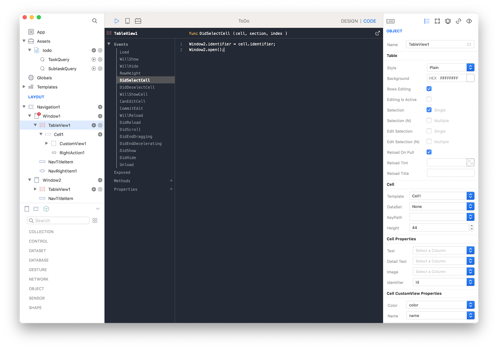

++21++ With the above code each time a user selects a row into the TableView1, the Window2 identifier property is set to the cell's identifier and Window2 is then opened. We now need to perform a query to extract the right row from the database based on this identifier. If you read the [Window](../classes/Window.html) documentation you can see that it has a **WillShow** event called each time the Window is about to be displayed. It seems the perfect place to write our code. So, select Window2, expand the Events tab and select the WillShow event.The following code will perform a new query based on the current identifier property:
```
// build sql based on identifier instance variable set by Window1
var sql = "SELECT * FROM Subtask WHERE task_id=\(identifier);";

// update query sql and re-run it
// there is no need to tell TableView1 to reload its DataSet
todo.SubtaskQuery.sql = sql;
todo.SubtaskQuery.run();

// reset editfield
TableView1.Header.TextField1.text = "";
```

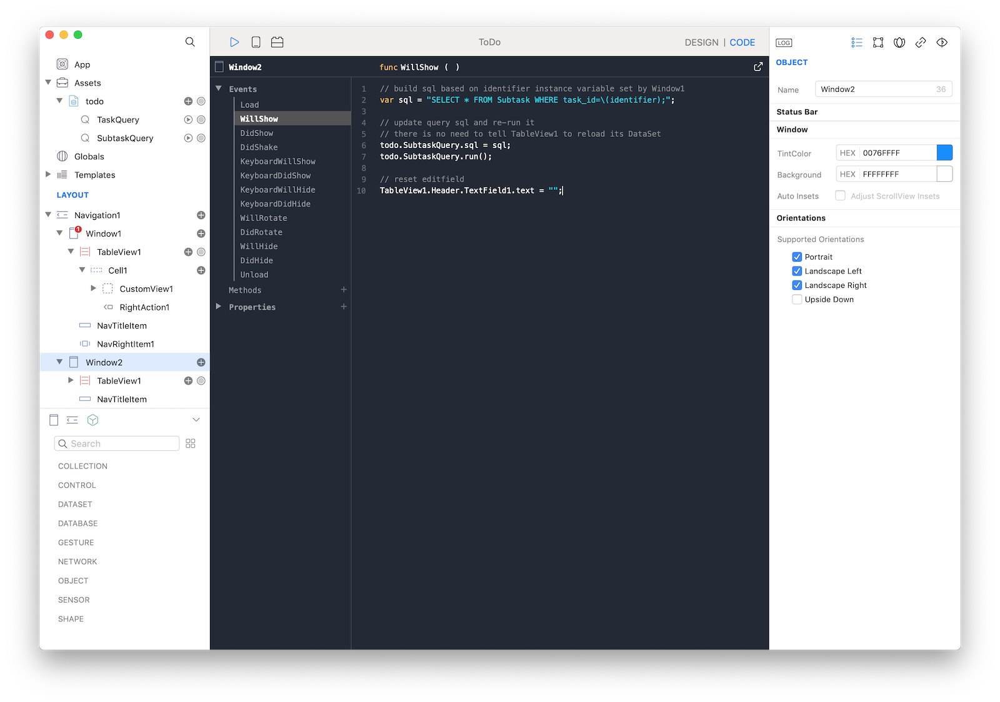

++22++ At this point we should start adding code to write to the sqlite database because we would need to both delete a subtask and add a new one in Window2. We could write all the sql write statement into the various actions (as we did in the previous WillShow event) but I prefer to isolate the code in a central point for easier readability and maintenance. So select the todo database object and add the following methods:
```
// add a new named subtask associated with a taskid
func addSubtask (taskID, name) {
	var sql = 'INSERT INTO Subtask (task_id, name) VALUES (\(taskID), "\(name)")';
	todo.execute(sql);
}

// add a new main task with a specified color
func addTask (name, color) {
	var sql = 'INSERT INTO Task (name, color) VALUES ("\(name)", "\(color)")';
	todo.execute(sql);
}

// removed a subtask specified by its id
func removeSubtask (subtaskID) {
	var sql = "DELETE FROM Subtask WHERE id = \(subtaskID)";
	todo.execute(sql);
}

// remove a task and all its associated subtasks
func removeTask (taskID) {
	// delete from the task table
	var sql = "DELETE FROM Task WHERE id = \(taskID)";
	todo.execute(sql);

	// remove entries from the subtask table
	sql = "DELETE FROM Subtask WHERE task_id = \(taskID)";
	todo.execute(sql);
}
```

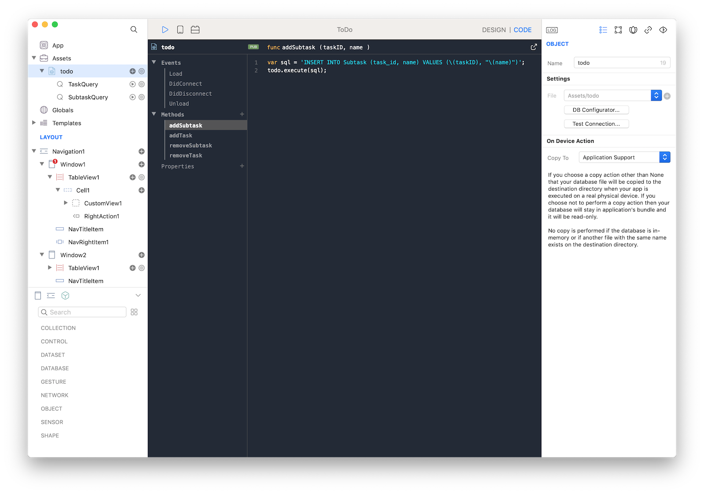

++23++ We now have all the required code to write to a database, we just need to call it in the right place. Select Button1 in the Header of the TableView1 inside Window2 and in the Action event write the following code:
```
// sanity check
var value = TextField1.text;
if (value.length == 0) return;

// inser new subtask
todo.addSubtask(identifier, value);

// force table reload
TableView1.reload(true);

// reset insert
TextField1.text = "";
Keyboard.hide();
```

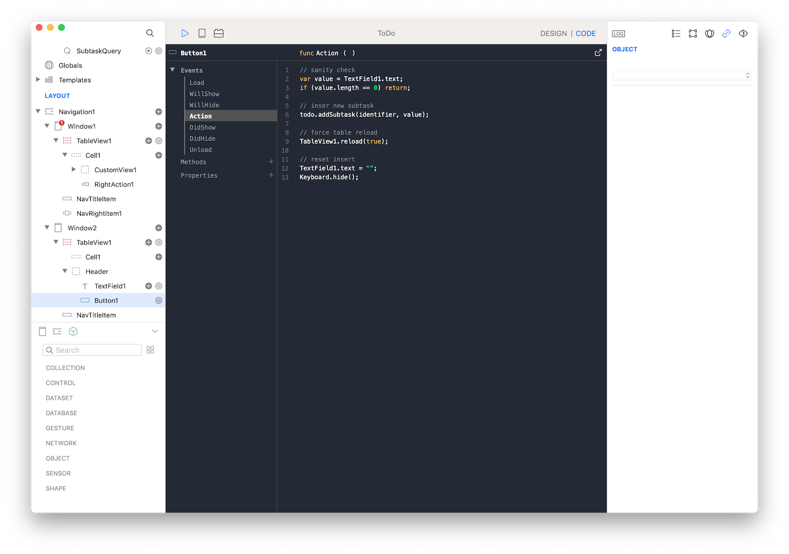

++24++ Select Cell1 in TableView1 (Window2), click on the **+** button and select the 'Right Action' menu item. This RightAction1 button will appear when table cell recognizes a left swipe gesture. Set the Title of the new RightAction1 to 'Delete' and the following code in its Action event:

```
todo.removeSubtask(cell.identifier);
todo.SubtaskQuery.run();
```

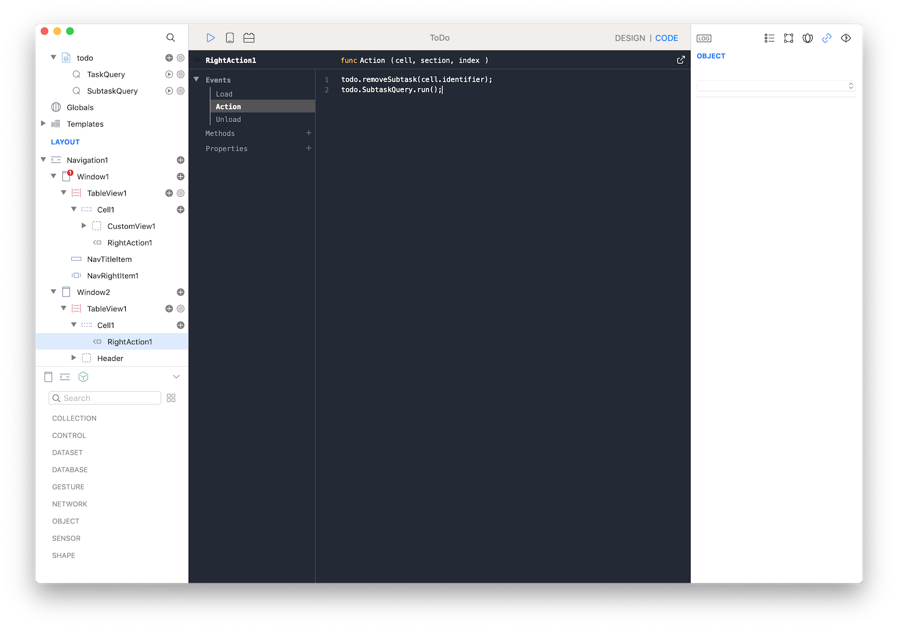

Now do the same thing in the Window1 (Cell1 in TableView1 inside Window1). This time the code of the Action event of the RightAction is:

```
todo.removeTask(cell.identifier);
todo.TaskQuery.run();
```

++25++ We now have finished our work in Window2. Just one final part is missed for a fully featured app, a way to create new main Task, so as we did in step 14 create a new Window3 (in this case the Window3 should be placed at the root level of the layout, outside the Navigation1 item). It is now time to fill Window3, so drop 12 controls with the following properties:

| Object | Property | Value |
| ---------- | --------- | --------- |
| **NameField** (EditField) | Placeholder | Task Name |
| **NameField** | Border Style | Round Rect |
| **NameField** | Frame | 5, 45, 362, 30 |
| **ColorLabel** (Label) | Text | Task Color |
| **ColorLabel** | Typography | Style Bold, Size 17, Alignment Center, Color #656565 |
| **ColorLabel** | Frame | 107, 102, 157, 44 |
| **ColorView** (View) | Frame | 200, 166, 132, 132 |
| **RedLabel** (Label) | Text | R |
| **RedLabel** | Typography | Style Bold, Size 15, Alignment Right, Color #656565 |
| **RedLabel** | Frame | 6, 156, 28, 44 |
| **GreenLabel** (Label) | Text | G |
| **GreenLabel** | Typography | Style Bold, Size 15, Alignment Right, Color #656565 |
| **GreenLabel** | Frame | 6, 206, 28, 44 |
| **BlueLabel** (Label) | Text | B |
| **BlueLabel** | Typography | Style Bold, Size 15, Alignment Right, Color #656565 |
| **BlueLabel** | Frame | 6, 256, 28, 44 |
| **RedSlider** (Slider) | Frame | 44, 166, 118, 31 |
| **GreenSlider** (Slider) | Frame | 44, 216, 118, 31 |
| **BlueSlider** (Slider) | Frame | 44, 266, 118, 31 |
| **BottomRect** (RectShape) | Fill Color | #F9F9F9 |
| **BottomRect** | Border Color | #A4A4A4B9 |
| **BottomRect** | Border Mask | Top only |
| **BottomRect** | Frame | 0, 623, 375, 46 |
| **CancelButton** (Button) | Title | Cancel |
| **CancelButton** | Typography | #Color 656565FF |
| **CancelButton** | Frame | 0, 622, 74, 44 |
| **SaveButton** (Button) | Title | Save |
| **SaveButton** | Typography | Style Bold, Color 656565FF |
| **SaveButton** | Frame | 301, 622, 74, 44 |


At the end of this long step Window3 should looks like:
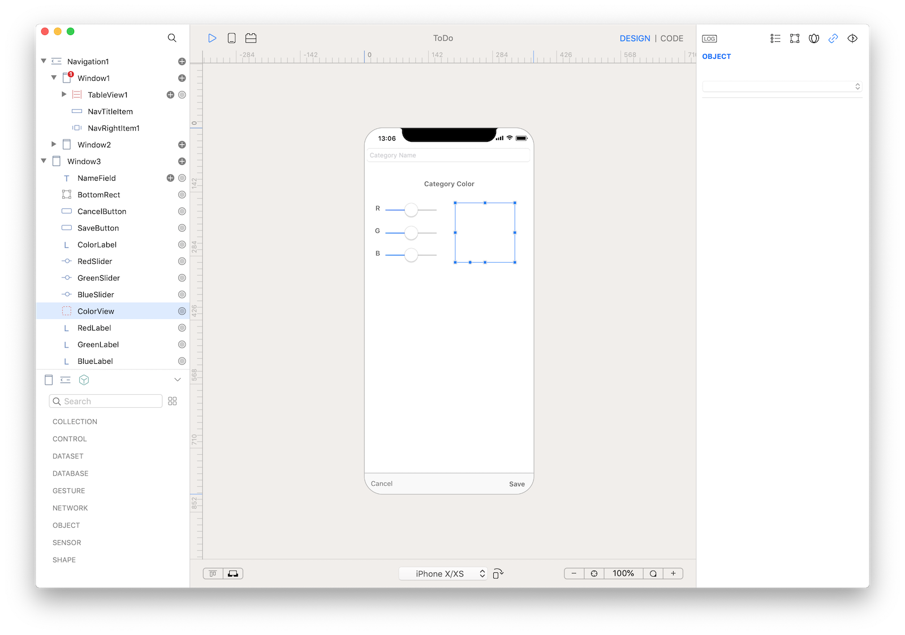

++26++ User interface for Window3 is almost finished, we now need to write some code and connect some logic. Select CancelButton and in the Action event write the following code:
```
Window3.close();
```

Then select the SaveButton and in the Action event write the following code:
```
// get values entered by user
var name = NameField.text;
var color = ColorView.backgroundColor.hex();

// sanity check
if (name.length == 0) return;

// write values to database
todo.addTask(name, color);

// close window
Window3.close();
```

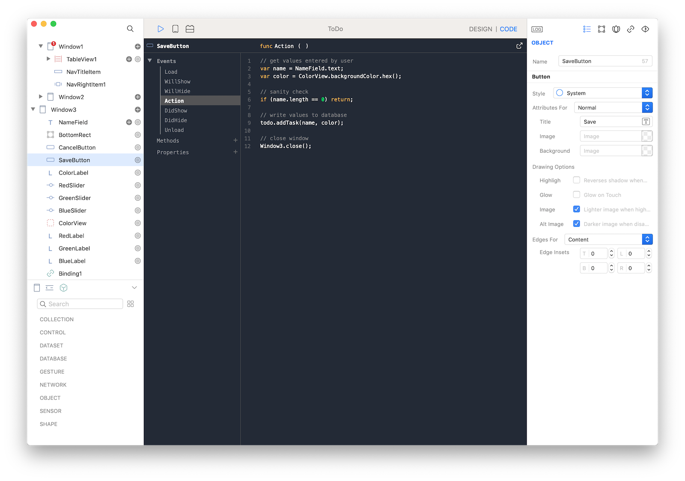

++27++ Everything seems to be correctly setup but one important step is missed. **How can the user select a custom color for the task?** Using a Binding! A Binding is a connection between values from different objects and Creo extends even more this powerful concept.

Start by connecting RedSlider to ColorView

A new Binding object will be automatically created for you (connect RedSlider.value to ColorView.backgroundColor). To create a multibinding connect GreenSlider and BlueSlider to Source area of the newly created Binding.

<video class="creovideo" width="700" height="427" autoplay loop controls>
<source src="../documentation/docs/images/tutorials/todo_binding.m4v" type="video/mp4">
</video>

++28++ We just created a connection (a Binding) between the values for 3 sliders to the background color of a View. Each slider will send a value between 0.0 and 1.0 to a destination that expects a Color. How can we transform that float values into a Color? It is actually pretty easy. Select Binding and in the SourceConversion event write the following code:
```
// in case of multibinding the value parameter is an array
var c = Color(value[0],value[1],value[2]);
return c;
```

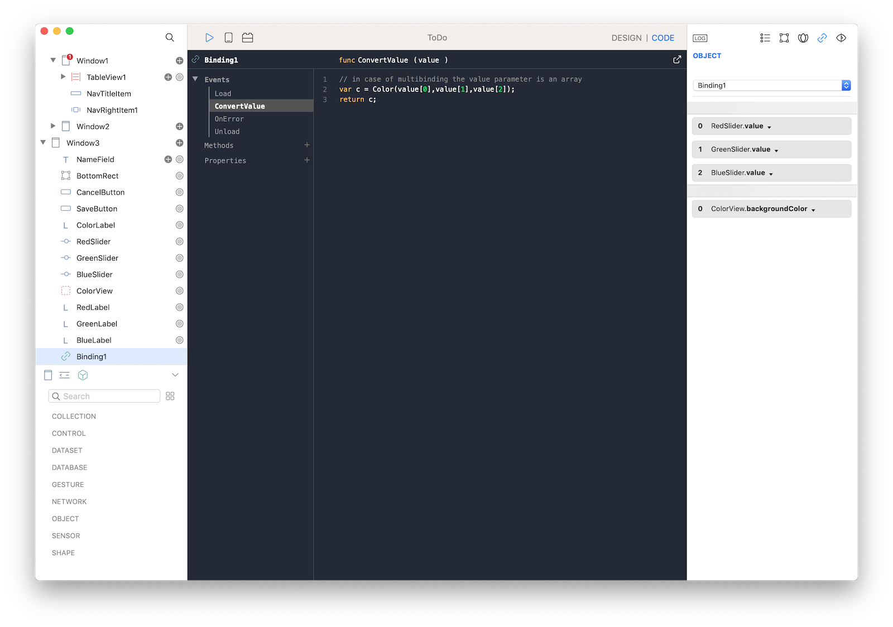
Now every time the user change a slider value, the View will change color in real time to reflect the actual color to use for the new task.


++29++ We now need to open Window3 (modal presentation) each time the user selects the + sign on Window1, to do so, select the NavRightItem1 inside the Window1 and in the Action event write the following code:
```
// no need to check the buttonTag property
// because there is just one button on the NavigationnBar
Window3.openModal(TransitionStyle.CoverVertical);
```

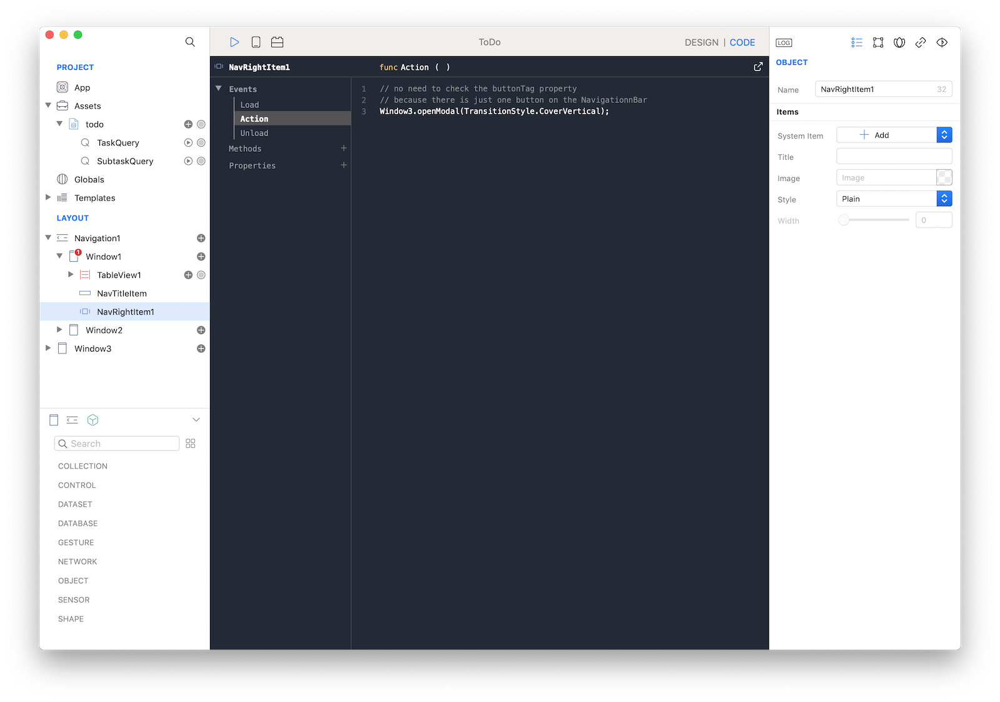

We have just added the code to open Window3 and in Window3 there is the code to add new Task to our database. How can we make sure that TableView1 is refreshed each time that Task table is modified? There is a simple solution for that and it involves forcing a refresh each time Window1 is shows. Select Window1 and in the WillShow event write the following code:
```
// refresh TableView and reload its DataSet
TableView1.reload(true);
```

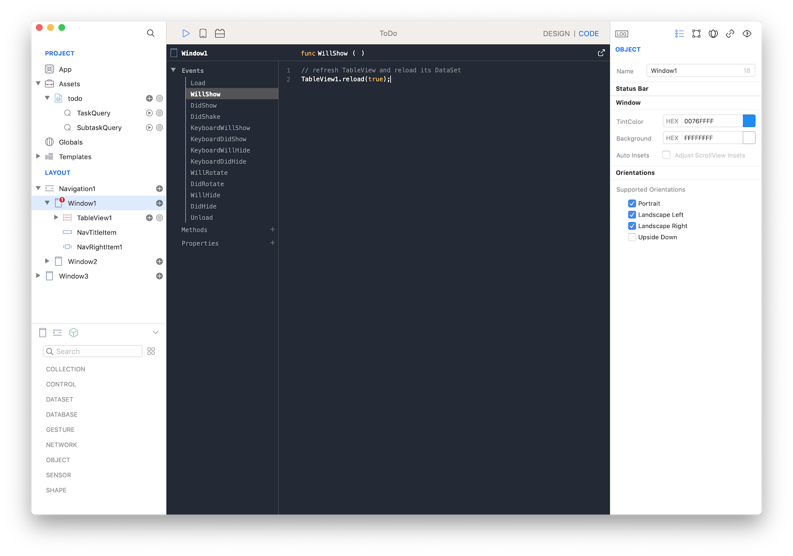

++30++ Press RUN and enjoy the ToDo app!

<video class="creovideo" width="700" height="427" autoplay loop controls>
<source src="../documentation/docs/images/tutorials/todo_play.m4v" type="video/mp4">
</video>

You can now send the app to **[CreoPlayer](../creo/creoplayer.md)** or **[build it](../creo/build-your-app.md)** and then submit to the App Store.

#### Project
* [ToDo.creoproject]({{github_raw_link}}/assets/todo.zip) (33KB)
